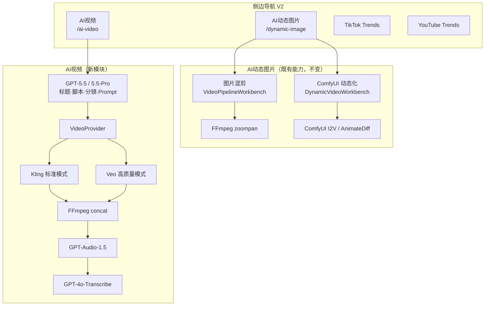
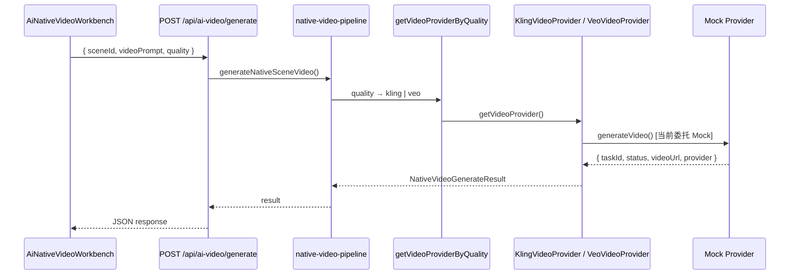
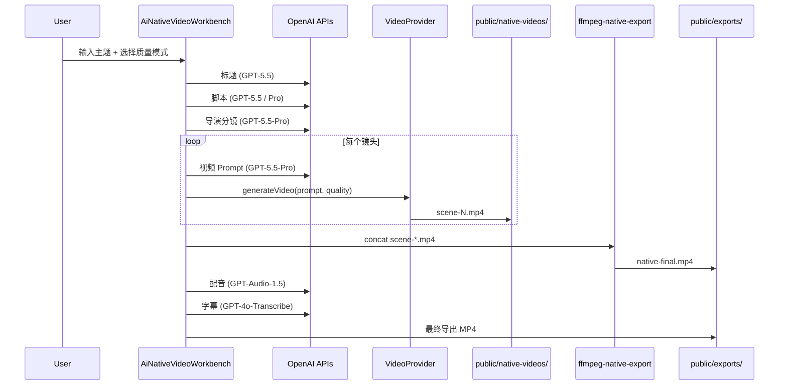

# AI 视频工作台 — 架构 V2

> 版本：V2.0  
> 日期：2026-05-27  
> 目标：明确区分 **AI动态图片** 与 **AI视频**，建立 **Veo + Kling** 双引擎 VideoProvider 架构。  
> 原则：**不修改现有业务流程、不删除现有功能、不重构现有页面 UI 风格**。

---

## 目录

1. [新目录结构](#1-新目录结构)
2. [AI动态图片架构](#2-ai动态图片架构)
3. [AI视频架构](#3-ai视频架构)
4. [VideoProvider 设计](#4-videoprovider-设计)
5. [VeoProvider 设计](#5-veoprovider-设计)
6. [KlingProvider 设计](#6-klingprovider-设计)
7. [GPT 模型映射表](#7-gpt-模型映射表)
8. [完整调用流程图](#8-完整调用流程图)
9. [后续接入真实 API 的位置](#9-后续接入真实-api-的位置)

---

## 1. 新目录结构

### 1.1 导航与路由（V2 目标态）

| 导航标签 | 路由 | 说明 |
|---------|------|------|
| AI动态图片 | `/dynamic-image` | 图片混剪 + ComfyUI 动态化（I2V / AnimateDiff） |
| AI视频 | `/ai-video` | 原生 AI 视频（Veo / Kling，非 I2V） |
| TikTok Trends | `/tiktok-trends` | 不变 |
| YouTube Trends | `/youtube-trends` | 不变 |

**向后兼容（保留，不删除）：**

| 旧路由 | 状态 |
|--------|------|
| `/dynamic-video` | 保留原页面，侧边栏高亮映射到「AI动态图片」 |
| `/image-mix` | 保留原页面，侧边栏高亮映射到「AI动态图片」 |
| `/` | 重定向 → `/dynamic-image` |

### 1.2 新增 / 调整目录树

```
ai-workspace/
├── app/
│   ├── page.tsx                          # redirect → /dynamic-image
│   ├── dynamic-image/page.tsx            # ★ 新入口：Tab 切换 图片混剪 / ComfyUI
│   ├── ai-video/page.tsx                 # ★ 新模块：原生 AI 视频
│   ├── dynamic-video/page.tsx            # 保留（ComfyUI 工作台）
│   ├── image-mix/page.tsx                # 保留（图片混剪工作台）
│   │
│   ├── api/
│   │   ├── dynamic-video/                # 不变 — AI动态图片 · ComfyUI 链路
│   │   ├── video/                        # 不变 — AI动态图片 · 图片混剪链路
│   │   └── ai-video/                     # ★ 新增 — 原生 AI 视频 API
│   │       └── generate/route.ts         # Mock Provider 调用入口
│   │
│   ├── components/
│   │   ├── VideoPipelineWorkbench.tsx    # 不变 — 图片混剪
│   │   ├── workflows/
│   │   │   ├── dynamic-video/            # 不变 — ComfyUI I2V
│   │   │   └── ai-video/                 # ★ 新增
│   │   │       └── AiNativeVideoWorkbench.tsx
│   │   └── layout/AppShell.tsx           # 导航更新 + 旧路由高亮兼容
│   │
│   └── lib/
│       ├── nav-config.ts                 # V2 四项导航 + resolveActiveNavId()
│       ├── workflows/
│       │   ├── dynamic-video/            # 不变
│       │   └── export-mode.ts            # href 指向 /dynamic-image?mode=*
│       │
│       └── video/                        # ★ 新增 — 原生 AI 视频 Provider 层
│           ├── index.ts
│           ├── types.ts
│           ├── video-provider.ts         # VideoProvider 接口 + 质量映射
│           ├── get-video-provider.ts     # Provider 注册表
│           ├── model-routing.ts          # GPT / 音频 / 字幕模型映射
│           ├── native-video-pipeline.ts  # 调用链编排（单镜 / 批量）
│           └── providers/
│               ├── veo-provider.ts       # Veo 入口（当前委托 Mock）
│               ├── kling-provider.ts     # Kling 入口（当前委托 Mock）
│               ├── mock-veo-provider.ts
│               └── mock-kling-provider.ts
│
├── public/
│   ├── exports/                          # 不变 — 最终 MP4
│   ├── dynamic-videos/                   # 不变 — ComfyUI 单镜片段
│   └── native-videos/                    # 未来 — 原生 AI 视频单镜片段
│       └── mock/
│
└── AI_VIDEO_ARCHITECTURE_V2.md           # 本文档
```

### 1.3 路径说明：`src/lib/video/` vs `app/lib/video/`

需求文档指定 `src/lib/video/`。本项目采用 **Next.js App Router**，业务库统一放在 `app/lib/`。  
**实际实现路径：`app/lib/video/`**，职责与 `src/lib/video/` 完全一致，可直接按本文档接口迁移。

### 1.4 与旧 `app/lib/ai-video/` 的关系

| 目录 | 用途 | 状态 |
|------|------|------|
| `app/lib/ai-video/` | ComfyUI / 旧 mock 视频生成（动态视频流水线内部） | **保留，不删除** |
| `app/lib/video/` | 原生 AI 视频 Veo + Kling Provider（新模块） | **新增，独立** |

两套 Provider **职责不同**，互不替换：

- `ai-video` → ComfyUI Image-to-Video（AI动态图片）
- `video` → Veo / Kling 文本原生视频（AI视频）

---

## 2. AI动态图片架构

### 2.1 定位

**AI动态图片** = 以静态图片为起点，通过运镜、I2V、AnimateDiff 等方式「动态化」。

包含能力（全部保留）：

| 能力 | 实现位置 | 技术 |
|------|----------|------|
| 图片混剪 | `VideoPipelineWorkbench` + `/api/video/*` | GPT 分镜 + zoompan FFmpeg |
| Image-to-Video | `DynamicVideoWorkbench` + ComfyUI | `workflows/image-to-video.json` |
| AnimateDiff | ComfyUI 工作流 | `workflows/animate-diff.json` |
| ComfyUI 动态图片 | `services/comfyService.ts` | 本地 RunPod ComfyUI |
| ZoomPan 运镜 | `ffmpeg-storyboard.ts` | FFmpeg zoompan 滤镜 |
| 图片动画 | 图片混剪导出链路 | 静态图 + 运镜合成 |

### 2.2 统一入口

`/dynamic-image` 页面通过 **Tab** 切换两种既有工作台，**不修改组件内部逻辑**：

```
/dynamic-image
├── Tab: 图片混剪      → VideoPipelineWorkbench（原 /image-mix）
└── Tab: ComfyUI 动态化 → DynamicVideoWorkbench（原 /dynamic-video）
```

URL 参数：`/dynamic-image?mode=mix` | `?mode=comfy`

### 2.3 工作流（保持不变）

```
标题
  ↓  GPT（/api/video/titles）
脚本
  ↓  GPT（/api/video/script）
分镜
  ↓  GPT（/api/video/storyboard 或 /api/dynamic-video/storyboard）
图片生成
  ↓  gpt-image-1（/api/video/storyboard/images）
动态化
  ↓  图片混剪：zoompan FFmpeg
  ↓  ComfyUI：/api/dynamic-video/generate-scene → ComfyUI I2V
字幕
  ↓  /api/video/subtitles
配音
  ↓  /api/video/tts（Edge TTS）
导出
  ↓  /api/video/export 或 /api/dynamic-video/export → public/exports/
```

### 2.4 关键文件（不变）

| 文件 | 职责 |
|------|------|
| `app/lib/pipeline-execute-step.ts` | 图片混剪步骤执行 |
| `app/lib/workflows/dynamic-video/execute-step.ts` | ComfyUI 动态化步骤执行 |
| `app/lib/workflows/dynamic-video/scene-generation.ts` | ComfyUI 镜头队列 |
| `app/api/dynamic-video/generate-scene/route.ts` | ComfyUI 单镜 API |
| `services/comfyService.ts` | ComfyUI HTTP 客户端 |
| `workflows/image-to-video.json` | I2V 工作流模板 |

---

## 3. AI视频架构

### 3.1 定位

**AI视频** = **原生 AI 视频生成**，从文本 Prompt 直接生成视频片段。

**明确排除：**

- ❌ 图片转视频（Image-to-Video）
- ❌ AnimateDiff
- ❌ ComfyUI 动态化
- ❌ ZoomPan 图片运镜

### 3.2 双模式（前端）

| UI 选项 | 引擎 | Provider |
|---------|------|----------|
| ○ 标准模式（推荐，默认） | Kling | `KlingVideoProvider` |
| ○ 高质量模式 | Veo | `VeoVideoProvider` |

映射常量：`app/lib/video/video-provider.ts` → `QUALITY_TO_PROVIDER`

### 3.3 完整工作流（目标态）

```
┌─────────────────────────────────────────────────────────────┐
│ 1. 标题生成          GPT-5.5                                │
│ 2. 脚本生成          GPT-5.5 / GPT-5.5-Pro（高级）          │
│ 3. 导演分镜          GPT-5.5-Pro                            │
│    输出：scene / character / action / camera /              │
│          duration / transition                              │
└─────────────────────────────────────────────────────────────┘
                            ↓
              每个镜头独立循环（scene-1, scene-2, …）
                            ↓
┌─────────────────────────────────────────────────────────────┐
│ 4. 视频 Prompt       GPT-5.5-Pro（per shot）                │
│ 5. VideoProvider     Kling（标准）或 Veo（高质量）           │
│ 6. 输出              scene-N.mp4                            │
└─────────────────────────────────────────────────────────────┘
                            ↓
┌─────────────────────────────────────────────────────────────┐
│ 7. FFmpeg 拼接       scene-*.mp4 → final.mp4               │
│ 8. 配音              GPT-Audio-1.5                          │
│ 9. 字幕              GPT-4o-Transcribe                      │
│10. 导出              public/exports/native-*.mp4           │
└─────────────────────────────────────────────────────────────┘
```

### 3.4 导演分镜数据结构

```typescript
// app/lib/video/types.ts
type NativeDirectorScene = {
  id: string;
  order: number;
  scene: string;       // 场景描述
  character: string;   // 角色
  action: string;      // 动作
  camera: string;      // 镜头语言
  durationSec: number; // 时长
  transition: string;  // 转场
  videoPrompt?: string;
  videoUrl?: string;
  taskId?: string;
};
```

### 3.5 当前阶段实现范围

| 层级 | 状态 |
|------|------|
| Provider 接口 + Mock | ✅ 已实现 |
| `/ai-video` 页面壳 + 质量切换 | ✅ 已实现 |
| `POST /api/ai-video/generate` | ✅ Mock 单镜 |
| GPT 标题/脚本/分镜 API | ⏳ 待接入（复用或新建 `/api/ai-video/*`） |
| FFmpeg 拼接 | ⏳ 待接入（参考 `ffmpeg-dynamic-export.ts`） |
| 配音 / 字幕 | ⏳ 待接入（复用 `/api/video/tts`、`/api/video/subtitles` 或专用路由） |

---

## 4. VideoProvider 设计

### 4.1 统一接口

```typescript
// app/lib/video/video-provider.ts

interface VideoProvider {
  readonly id: "kling" | "veo";
  readonly label: string;
  generateVideo(
    input: NativeVideoGenerateInput,
    opts?: { onProgress?: (message: string) => void }
  ): Promise<NativeVideoGenerateResult>;
}
```

### 4.2 统一输入

```typescript
type NativeVideoGenerateInput = {
  sceneId: string;
  videoPrompt: string;
  durationSec: number;
  directorScene?: NativeDirectorScene;
};
```

### 4.3 统一返回

```typescript
type NativeVideoGenerateResult = {
  taskId: string;
  status: "pending" | "processing" | "completed" | "failed";
  videoUrl: string | null;
  provider: "kling" | "veo";
  simulated?: boolean;  // Mock 阶段为 true
  error?: string;
};
```

### 4.4 Provider 注册与选择

```typescript
// app/lib/video/get-video-provider.ts

const REGISTRY = { kling: klingVideoProvider, veo: veoVideoProvider };

getVideoProvider(id)           // 按引擎 ID
getVideoProviderByQuality(q)   // 按质量档位 → 自动选 Kling/Veo
```

### 4.5 调用链编排

```typescript
// app/lib/video/native-video-pipeline.ts

generateNativeSceneVideo(input, { quality })  // 单镜
generateNativeSceneQueue(scenes, prompts, quality)  // 批量顺序生成
```

### 4.6 Mock → 真实 API 替换策略

```
MockKlingVideoProvider  ──替换──►  KlingVideoProvider.generateVideo() 真实 HTTP
MockVeoVideoProvider    ──替换──►  VeoVideoProvider.generateVideo() 真实 HTTP
```

**对外接口、返回结构、调用方代码均不变。**

---

## 5. VeoProvider 设计

### 5.1 文件

`app/lib/video/providers/veo-provider.ts`  
`app/lib/video/providers/mock-veo-provider.ts`

### 5.2 职责

- **高质量模式**默认引擎
- 接收 GPT-5.5-Pro 生成的 `videoPrompt`
- 调用 Google Veo API（未来）
- 轮询任务状态 → 下载 MP4 → 写入 `public/native-videos/`

### 5.3 当前实现（Mock）

```typescript
class MockVeoVideoProvider implements VideoProvider {
  id = "veo";
  async generateVideo(input) {
    await sleep(1200);
    return {
      taskId: `veo-mock-${uuid}`,
      status: "completed",
      videoUrl: `/native-videos/mock/${input.sceneId}-veo.mp4`,
      provider: "veo",
      simulated: true,
    };
  }
}
```

### 5.4 真实 API 接入要点（未来）

| 步骤 | 说明 |
|------|------|
| 环境变量 | `GOOGLE_VEO_API_KEY`、`VEO_MODEL_ID` |
| 提交任务 | POST 创建 generation job，传入 prompt + duration |
| 轮询 | GET job status until `completed` / `failed` |
| 下载 | 保存至 `public/native-videos/{sceneId}.mp4` |
| 错误处理 | 映射为 `status: "failed"` + `error` 字段 |

**修改位置：** 仅 `veo-provider.ts`，移除对 `mockVeoVideoProvider` 的委托。

---

## 6. KlingProvider 设计

### 6.1 文件

`app/lib/video/providers/kling-provider.ts`  
`app/lib/video/providers/mock-kling-provider.ts`

### 6.2 职责

- **标准模式（默认）**引擎
- 接收 GPT-5.5-Pro 生成的 `videoPrompt`
- 调用 Kling AI API（未来）
- 异步任务 → 下载 MP4 → 写入 `public/native-videos/`

### 6.3 当前实现（Mock）

```typescript
class MockKlingVideoProvider implements VideoProvider {
  id = "kling";
  async generateVideo(input) {
    await sleep(800);
    return {
      taskId: `kling-mock-${uuid}`,
      status: "completed",
      videoUrl: `/native-videos/mock/${input.sceneId}-kling.mp4`,
      provider: "kling",
      simulated: true,
    };
  }
}
```

### 6.4 真实 API 接入要点（未来）

| 步骤 | 说明 |
|------|------|
| 环境变量 | `KLING_API_KEY`、`KLING_API_BASE` |
| 提交任务 | POST text-to-video，传入 prompt + duration |
| 轮询 | GET task by `taskId` |
| 下载 | 保存至 `public/native-videos/{sceneId}.mp4` |
| 错误处理 | 映射为统一 `NativeVideoGenerateResult` |

**修改位置：** 仅 `kling-provider.ts`，移除对 `mockKlingVideoProvider` 的委托。

---

## 7. GPT 模型映射表

定义文件：`app/lib/video/model-routing.ts`

| 任务 | 架构目标模型 | 常量键 | 当前实际调用 |
|------|-------------|--------|-------------|
| 标题生成 | GPT-5.5 | `title` | 复用 `buildModelCandidates()` 回退链 |
| 普通脚本 | GPT-5.5 | `script` | 同上 |
| 高级脚本 | GPT-5.5-Pro | `script-advanced` | 同上 |
| 导演分镜 | GPT-5.5-Pro | `director-storyboard` | 待新建 API |
| 视频 Prompt | GPT-5.5-Pro | `video-prompt` | 待新建 API |
| 配音 | GPT-Audio-1.5 | `voiceover` | 当前 Edge TTS，未来切换 |
| 字幕 | GPT-4o-Transcribe | `subtitles` | 当前 Whisper/现有 API，未来切换 |

```typescript
export const AI_VIDEO_MODEL_MAP = {
  title: "gpt-5.5",
  script: "gpt-5.5",
  "script-advanced": "gpt-5.5-pro",
  "director-storyboard": "gpt-5.5-pro",
  "video-prompt": "gpt-5.5-pro",
  voiceover: "gpt-audio-1.5",
  subtitles: "gpt-4o-transcribe",
};
```

**接入方式：** 各 API route 调用 `resolveAiVideoModel(task)` 获取目标模型名，再传入 OpenAI 客户端；模型不可用时回退至 `buildModelCandidates()`。

---

## 8. 完整调用流程图

### 8.1 模块总览



### 8.2 AI视频单镜生成（当前 Mock 链路）



### 8.3 AI视频完整流水线（目标态）



### 8.4 AI动态图片 vs AI视频 对比

| 维度 | AI动态图片 | AI视频 |
|------|-----------|--------|
| 输入 | 图片 + 可选文本 | 纯文本 Prompt |
| 生成方式 | zoompan / ComfyUI I2V | Veo / Kling 原生 T2V |
| Provider 层 | `app/lib/ai-video/`（ComfyUI） | `app/lib/video/`（Veo/Kling） |
| 输出目录 | `public/dynamic-videos/` | `public/native-videos/` |
| 导出 | `ffmpeg-dynamic-export.ts` | 待建 `ffmpeg-native-export.ts` |
| 路由 | `/dynamic-image` | `/ai-video` |

---

## 9. 后续接入真实 API 的位置

### 9.1 优先级 P0 — Video Provider 真实化

| 文件 | 操作 |
|------|------|
| `providers/kling-provider.ts` | 实现真实 Kling HTTP，替换 Mock 委托 |
| `providers/veo-provider.ts` | 实现真实 Veo HTTP，替换 Mock 委托 |
| `.env` | 添加 `KLING_API_KEY`、`GOOGLE_VEO_API_KEY` |

**无需修改：** `video-provider.ts`、`get-video-provider.ts`、`native-video-pipeline.ts`、API route、前端质量切换。

### 9.2 优先级 P1 — AI视频 GPT 流水线 API

建议新增路由（不影响现有 `/api/video/*`、`/api/dynamic-video/*`）：

```
app/api/ai-video/
├── titles/route.ts           # GPT-5.5 标题
├── script/route.ts           # GPT-5.5 / 5.5-Pro 脚本
├── storyboard/route.ts       # GPT-5.5-Pro 导演分镜
├── video-prompt/route.ts     # GPT-5.5-Pro 单镜 Prompt
├── generate/route.ts         # ✅ 已有 Mock
├── export/route.ts           # FFmpeg 拼接 + 混音
└── export/stream/route.ts    # SSE 进度
```

各 route 内调用 `resolveAiVideoModel(task)` 选择模型。

### 9.3 优先级 P2 — FFmpeg 原生视频导出

参考现有：

- `app/lib/ffmpeg-dynamic-export.ts` — ComfyUI 镜头拼接
- `app/lib/ffmpeg-storyboard.ts` — 图片混剪导出

新建：

- `app/lib/ffmpeg-native-export.ts` — 拼接 `public/native-videos/scene-*.mp4` → `public/exports/native-*.mp4`

### 9.4 优先级 P3 — 配音 / 字幕切换

| 当前 | 目标 | 修改位置 |
|------|------|----------|
| Edge TTS | GPT-Audio-1.5 | 新建 `/api/ai-video/tts` 或扩展 model-routing |
| 现有字幕 API | GPT-4o-Transcribe | 新建 `/api/ai-video/subtitles` |

可复用 `app/lib/edge-tts-server.ts` 作为回退。

### 9.5 优先级 P4 — 完整 UI 工作流

在 `AiNativeVideoWorkbench.tsx` 中接入完整 Pipeline（参考 `DynamicVideoWorkbench` 的步骤模式），**复用现有 Pipeline UI 组件风格**，不修改全局 CSS。

步骤建议：

```
title → script → storyboard → native-video → subtitles → voiceover → export
```

对应新建 `app/lib/workflows/ai-video/steps.ts` + `execute-step.ts`。

### 9.6 环境变量清单（未来）

```bash
# Kling
KLING_API_KEY=
KLING_API_BASE=https://api.klingai.com

# Google Veo
GOOGLE_VEO_API_KEY=
VEO_MODEL_ID=

# 模型覆盖（可选）
AI_MODEL_GPT_5_5=
AI_MODEL_GPT_5_5_PRO=
AI_MODEL_GPT_AUDIO_1_5=
AI_MODEL_GPT_4O_TRANSCRIBE=
```

---

## 附录 A：V2 变更清单

| 变更 | 类型 | 说明 |
|------|------|------|
| `app/lib/video/*` | 新增 | VideoProvider 架构 + Mock |
| `app/dynamic-image/page.tsx` | 新增 | 统一入口 Tab |
| `app/ai-video/page.tsx` | 新增 | 原生 AI 视频模块 |
| `app/api/ai-video/generate/route.ts` | 新增 | Mock 单镜 API |
| `app/lib/nav-config.ts` | 修改 | 四项导航 |
| `app/components/layout/AppShell.tsx` | 修改 | 图标 + 旧路由高亮 |
| `app/page.tsx` | 修改 | redirect → `/dynamic-image` |
| `app/lib/workflows/export-mode.ts` | 修改 | href 更新 |
| 既有 Workbench / API / ComfyUI | **不变** | 零删除 |

---

## 附录 B：验收标准（当前阶段）

- [x] Provider 接口抽象（`VideoProvider.generateVideo`）
- [x] 统一返回结构 `{ taskId, status, videoUrl, provider }`
- [x] Kling / Veo Mock Provider 可切换
- [x] 质量档位映射（标准→Kling，高质量→Veo）
- [x] 调用链设计（`native-video-pipeline.ts`）
- [x] 导航四项 + 路由 `/dynamic-image`、`/ai-video`
- [x] 旧路由 `/dynamic-video`、`/image-mix` 仍可用
- [x] 未接入真实 Veo / Kling API
- [x] 未删除任何现有功能
- [x] 未重构现有 Workbench 内部逻辑

---

*文档结束 — AI 视频工作台架构 V2*
