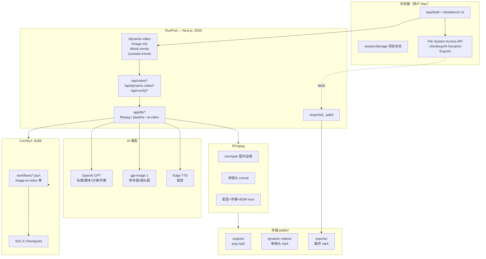

# AI 视频工作台 — 完整系统分析

> 基于 `/Users/mac/ai-workspace` 现有代码的只读分析文档。  
> 生成时间：2026-06-03  
> **未修改任何业务代码。**

---

## 目录

1. [第一部分：项目结构](#第一部分项目结构)
2. [第二部分：功能模块](#第二部分功能模块)
3. [第三部分：AI 动态视频完整流水线](#第三部分ai-动态视频完整流水线)
4. [第四部分：图片混剪完整流水线](#第四部分图片混剪完整流水线)
5. [第五部分：视频生成能力判断](#第五部分视频生成能力判断)
6. [第六部分：导出系统分析](#第六部分导出系统分析)
7. [第七部分：系统架构图](#第七部分系统架构图)

---

## 第一部分：项目结构

### 1.1 完整项目目录树（核心部分）

```
ai-workspace/
├── app/                              # Next.js App Router 应用根目录
│   ├── page.tsx                      # 根路由 → redirect("/dynamic-video")
│   ├── layout.tsx                    # 全局布局、字体、主题
│   ├── globals.css                   # 全局样式
│   │
│   ├── dynamic-video/                # ★ 核心页面：AI 动态视频
│   │   └── page.tsx
│   ├── image-mix/                    # ★ 核心页面：图片混剪
│   │   └── page.tsx
│   ├── tiktok-trends/                # TikTok 趋势分析页
│   │   └── page.tsx
│   ├── youtube-trends/               # YouTube 趋势分析页
│   │   └── page.tsx
│   │
│   ├── exports/[...path]/            # ★ 运行时导出文件下载路由
│   │   └── route.ts
│   │
│   ├── api/                          # ★ 全部后端 API 路由
│   │   ├── comfy/                    # ComfyUI 状态代理
│   │   │   ├── history/route.ts
│   │   │   ├── progress/route.ts
│   │   │   └── interrupt/route.ts
│   │   ├── dynamic-video/            # 动态视频专用 API
│   │   │   ├── storyboard/route.ts
│   │   │   ├── generate-scene/route.ts
│   │   │   ├── export/route.ts
│   │   │   └── export/stream/route.ts
│   │   ├── video/                    # 两条流水线共用 API
│   │   │   ├── titles/route.ts
│   │   │   ├── script/route.ts
│   │   │   ├── storyboard/route.ts
│   │   │   ├── storyboard/images/route.ts
│   │   │   ├── subtitles/route.ts
│   │   │   ├── tts/route.ts
│   │   │   ├── export/route.ts
│   │   │   ├── export/stream/route.ts
│   │   │   └── export/cleanup/route.ts
│   │   ├── tiktok/trends/route.ts
│   │   ├── youtube/trends/route.ts
│   │   └── openai/stats/route.ts
│   │
│   ├── components/                   # React 组件
│   │   ├── layout/
│   │   │   ├── AppShell.tsx          # ★ 统一外壳 + 侧边导航
│   │   │   └── OpenAIStatsBar.tsx    # OpenAI 用量统计条
│   │   ├── export/
│   │   │   ├── ExportProgressPanel.tsx
│   │   │   └── ExportDownloadActions.tsx  # 下载/复制/桌面保存
│   │   ├── pipeline/                 # 图片混剪流水线 UI 组件
│   │   │   ├── PipelineRunContext.tsx
│   │   │   ├── PipelineStepContent.tsx
│   │   │   ├── PipelineOutputSidebar.tsx
│   │   │   └── useExportStream.ts
│   │   ├── workflows/dynamic-video/  # 动态视频专用 UI
│   │   │   ├── DynamicVideoWorkbench.tsx  # ★ 主工作台
│   │   │   ├── DynamicSceneGrid.tsx
│   │   │   ├── VideoParamsPanel.tsx
│   │   │   ├── ComfyStatusBadge.tsx
│   │   │   └── ...
│   │   ├── VideoPipelineWorkbench.tsx     # ★ 图片混剪主工作台
│   │   ├── storyboard/SceneGrid.tsx
│   │   ├── tiktok/TikTokTrendsPage.tsx
│   │   └── youtube/YouTubeTrendsPage.tsx
│   │
│   └── lib/                          # ★ 核心业务逻辑库
│       ├── nav-config.ts             # 导航配置（4 个模块）
│       ├── openai-key.ts             # OpenAI 客户端封装
│       ├── edge-tts-server.ts        # Edge TTS 配音
│       ├── video-types.ts            # 图片混剪 Pipeline 类型
│       ├── storyboard-types.ts       # 分镜数据结构
│       ├── pipeline-execute-step.ts  # 图片混剪步骤执行器
│       ├── pipeline-steps.ts         # 图片混剪步骤定义
│       ├── ffmpeg-storyboard.ts      # ★ 图片混剪 FFmpeg 导出
│       ├── ffmpeg-dynamic-export.ts  # ★ 动态视频 FFmpeg 导出
│       ├── ffmpeg-spawn.ts           # FFmpeg 进程管理
│       ├── ffmpeg-process-manager.ts
│       ├── export-progress.ts        # 导出 SSE 进度状态
│       ├── video-output.ts           # 文件路径 / public 资源
│       ├── export/
│       │   ├── getExportDirectory.ts # 服务端导出目录
│       │   ├── desktop-save.ts       # 浏览器写入 Mac 桌面
│       │   ├── trigger-download.ts
│       │   └── constants.ts
│       ├── workflows/
│       │   ├── dynamic-video/        # 动态视频工作流
│       │   │   ├── execute-step.ts   # ★ 动态视频步骤执行器
│       │   │   ├── scene-generation.ts
│       │   │   ├── steps.ts
│       │   │   └── video-params.ts
│       │   ├── export-mode.ts
│       │   └── project-store.ts      # sessionStorage 状态持久化
│       ├── ai-video/                 # AI 视频生成抽象层
│       │   ├── server.ts             # Provider 路由
│       │   ├── generate-scene-core.ts
│       │   ├── generate-reference-image.ts
│       │   └── providers/
│       │       ├── comfy.ts          # ★ ComfyUI I2V
│       │       ├── mock.ts
│       │       └── kling.ts
│       └── comfy/
│           ├── workflow-templates.ts # Workflow JSON 注入
│           ├── constants.ts
│           └── image-to-mp4.ts       # 静态图转 mp4 兜底
│
├── services/
│   └── comfyService.ts               # ★ ComfyUI HTTP API 封装
│
├── workflows/                        # ComfyUI workflow JSON 模板
│   ├── image-to-video.json           # ★ 默认 I2V
│   ├── anime-video.json
│   ├── animate-diff.json
│   └── txt2img.json
│
├── scripts/
│   ├── run-comfyui.sh                # RunPod/Linux 启动 ComfyUI
│   └── test-export-matrix.ts         # 导出矩阵集成测试
│
├── public/                           # 静态资源 & 运行时输出
│   ├── exports/                      # ★ 最终 MP4 导出目录
│   ├── dynamic-videos/               # ComfyUI 单镜头视频片段
│   ├── outputs/                      # GPT 图片 / TTS 音频
│   ├── bgm/                          # 默认背景音乐
│   └── videos/                       # 预留（当前未写入）
│
├── package.json
├── README.md
└── next.config.ts
```

> **说明：** `public/exports/` 下可能存在大量测试产物（`test-*`、`dynamic-*`），属于运行时文件，非源码结构。

---

### 1.2 核心页面入口

| 路径 | 文件 | 说明 |
|------|------|------|
| `/` | `app/page.tsx` | 重定向到 `/dynamic-video` |
| `/dynamic-video` | `app/dynamic-video/page.tsx` | AI 动态视频（默认首页） |
| `/image-mix` | `app/image-mix/page.tsx` | 图片混剪 |
| `/tiktok-trends` | `app/tiktok-trends/page.tsx` | TikTok 趋势 |
| `/youtube-trends` | `app/youtube-trends/page.tsx` | YouTube 趋势 |

导航定义：`app/lib/nav-config.ts` → `APP_NAV_ITEMS`

统一外壳：`app/components/layout/AppShell.tsx`（侧边栏 + `PipelineRunProvider`）

---

### 1.3 API 路由清单

#### 共用（两条视频流水线）

| 方法 | 路由 | 文件 | 作用 |
|------|------|------|------|
| POST | `/api/video/titles` | `api/video/titles/route.ts` | GPT 生成标题 |
| POST | `/api/video/script` | `api/video/script/route.ts` | GPT 生成脚本 |
| POST | `/api/video/storyboard` | `api/video/storyboard/route.ts` | GPT 分镜（图片混剪） |
| POST | `/api/video/storyboard/images` | `api/video/storyboard/images/route.ts` | gpt-image-1 生成镜头图 |
| POST | `/api/video/subtitles` | `api/video/subtitles/route.ts` | GPT 场景字幕 |
| POST | `/api/video/tts` | `api/video/tts/route.ts` | Edge TTS 配音 |
| POST | `/api/video/export` | `api/video/export/route.ts` | 图片混剪 FFmpeg 导出 |
| GET | `/api/video/export/stream` | `api/video/export/stream/route.ts` | 导出 SSE 进度 |
| POST | `/api/video/export/cleanup` | `api/video/export/cleanup/route.ts` | 清理临时文件 |

#### 动态视频专用

| 方法 | 路由 | 文件 | 作用 |
|------|------|------|------|
| POST | `/api/dynamic-video/storyboard` | `api/dynamic-video/storyboard/route.ts` | GPT 动态分镜 |
| POST | `/api/dynamic-video/generate-scene` | `api/dynamic-video/generate-scene/route.ts` | 单镜头 AI 视频生成 |
| POST | `/api/dynamic-video/export` | `api/dynamic-video/export/route.ts` | 动态视频 FFmpeg 导出 |
| GET | `/api/dynamic-video/export/stream` | `api/dynamic-video/export/stream/route.ts` | 导出 SSE 进度 |

#### ComfyUI 代理

| 方法 | 路由 | 作用 |
|------|------|------|
| GET | `/api/comfy/progress` | 队列/在线状态 |
| GET | `/api/comfy/history` | 历史记录 |
| POST | `/api/comfy/interrupt` | 中断生成 |

#### 趋势 & 工具

| 方法 | 路由 | 作用 |
|------|------|------|
| POST | `/api/tiktok/trends` | TikTok 趋势（GPT 模拟） |
| POST | `/api/youtube/trends` | YouTube 趋势（API 或 GPT） |
| GET | `/api/openai/stats` | OpenAI 用量统计 |
| GET | `/exports/[...path]` | 运行时读取导出 MP4 |

---

### 1.4 Service 层

| 文件 | 职责 |
|------|------|
| `services/comfyService.ts` | ComfyUI HTTP：`submitWorkflow`、`waitForPrompt`、`uploadImage`、`getVideo`、`checkComfyOnline` |
| `app/lib/openai-key.ts` | OpenAI `chatCompletion`、API Key 读取 |
| `app/lib/edge-tts-server.ts` | Edge TTS 语音合成 |
| `app/lib/ai-video/server.ts` | AI 视频 Provider 路由（comfy/kling/mock/stub） |
| `app/lib/ai-video/providers/comfy.ts` | ComfyUI I2V 业务逻辑 |
| `app/lib/ffmpeg-storyboard.ts` | 图片混剪多镜头 FFmpeg 合成 |
| `app/lib/ffmpeg-dynamic-export.ts` | 动态视频多镜头 FFmpeg 合成 |

> 项目没有独立的 `services/` 多层架构；大部分 Service 逻辑在 `app/lib/` 中。

---

### 1.5 工具类 & 公共组件

#### 工具类（`app/lib/`）

| 模块 | 作用 |
|------|------|
| `pipeline-retry.ts` | 带重试的 `fetch` POST |
| `export-progress.ts` | 导出任务进度、SSE 推送 |
| `video-output.ts` | `public/outputs`、`public/dynamic-videos`、`public/exports` 路径 |
| `video-duration.ts` | 时长约束、字幕裁剪 |
| `storyboard-ass.ts` | ASS 字幕文件生成 |
| `subtitles.ts` / `scene-subtitles.ts` | 字幕构建 |
| `export-quality.ts` | FFmpeg 编码档位 |
| `workflows/project-store.ts` | sessionStorage 项目状态 |

#### 公共组件

| 组件 | 作用 |
|------|------|
| `AppShell` | 导航 + 主题切换 |
| `OpenAIStatsBar` | 顶部 OpenAI 统计 |
| `ExportProgressPanel` | 导出进度 / 成功面板 |
| `ExportDownloadActions` | 下载、复制链接、Mac 桌面保存 |
| `PipelineRunContext` | 全局流水线运行/停止状态 |
| `SceneGrid` | 分镜缩略图网格 |

---

## 第二部分：功能模块

### 2.1 AI 动态视频

| 项 | 内容 |
|----|------|
| **页面入口** | `/dynamic-video` → `DynamicVideoWorkbench.tsx` |
| **步骤** | title → script → storyboard → **ai-video** → subtitles → voiceover → export |
| **调用链** | UI `runStep`/`runAll` → `executeDynamicPipelineStep` → 各 `/api/*` → `lib/` → 外部服务 |
| **使用模型** | OpenAI GPT（标题/脚本/分镜/字幕）、gpt-image-1（首帧参考图）、ComfyUI SD1.5 I2V（默认）、Edge TTS |
| **输出结果** | 单镜头：`public/dynamic-videos/*.mp4`；最终：`public/exports/dynamic-*.mp4` |
| **依赖** | RunPod Next.js、OpenAI API、ComfyUI :8188、FFmpeg、Edge TTS |

**关键文件：**
- 执行器：`app/lib/workflows/dynamic-video/execute-step.ts`
- 镜头队列：`app/lib/workflows/dynamic-video/scene-generation.ts`
- 单镜 API：`app/api/dynamic-video/generate-scene/route.ts`
- 核心生成：`app/lib/ai-video/generate-scene-core.ts`

---

### 2.2 图片混剪

| 项 | 内容 |
|----|------|
| **页面入口** | `/image-mix` → `VideoPipelineWorkbench.tsx` |
| **步骤** | title → script → storyboard → **scenes** → subtitles → voiceover → export |
| **调用链** | UI → `executePipelineStep` → `/api/video/*` → `ffmpeg-storyboard.ts` |
| **使用模型** | OpenAI GPT、gpt-image-1（镜头静态图）、Edge TTS |
| **输出结果** | 镜头图：`public/outputs/*.png`；最终 MP4：`public/exports/dynamic-*.mp4` |
| **依赖** | OpenAI API、FFmpeg（无 ComfyUI） |

**与动态视频的区别：** 第 4 步是 `scenes`（生成静态图），不是 `ai-video`；导出走 `/api/video/export` + `ffmpeg-storyboard.ts`（zoompan 运镜）。

---

### 2.3 TikTok Trends

| 项 | 内容 |
|----|------|
| **页面入口** | `/tiktok-trends` → `TikTokTrendsPage.tsx` |
| **调用链** | 前端 POST → `/api/tiktok/trends` → `chatCompletion`（OpenAI） |
| **使用模型** | OpenAI GPT（**模拟**趋势，非实时爬虫） |
| **输出** | 热门标题列表、关键词、200 字分析 |
| **依赖** | `OPENAI_API_KEY` |

---

### 2.4 YouTube Trends

| 项 | 内容 |
|----|------|
| **页面入口** | `/youtube-trends` → `YouTubeTrendsPage.tsx` |
| **调用链** | 前端 POST → `/api/youtube/trends` → YouTube Data API（可选）或 GPT 回退 |
| **使用模型** | YouTube API v3（需 `YOUTUBE_API_KEY`）+ OpenAI GPT 分析 |
| **输出** | 热门视频、规律总结、生成标题建议 |
| **依赖** | `OPENAI_API_KEY`；可选 `YOUTUBE_API_KEY` |

---

## 第三部分：AI 动态视频完整流水线

### 3.1 「一键全流程」入口

```
用户点击「一键全流程」
  ↓
DynamicVideoWorkbench.runAll()          [DynamicVideoWorkbench.tsx:342]
  ↓
for step in DYNAMIC_PIPELINE_ORDER:     [steps.ts]
  runStep(step, batch=true)
  ↓
executeDynamicPipelineStep(stepId)      [execute-step.ts]
```

步骤顺序（`app/lib/workflows/dynamic-video/steps.ts`）：
```
title → script → storyboard → ai-video → subtitles → voiceover → export
```

---

### 3.2 逐步调用链

#### 步骤 1：标题生成

```
用户操作：输入主题 → 执行 title
  ↓ 页面：DynamicVideoWorkbench
  ↓ API：POST /api/video/titles          { topic }
  ↓ Service：openai-key.chatCompletion
  ↓ OpenAI：GPT JSON → titles[]
  ↓ 输出：pipeline.titles, selectedTitle
```

#### 步骤 2：脚本生成

```
  ↓ API：POST /api/video/script          { topic, title }
  ↓ OpenAI：GPT → script 文本
  ↓ 输出：pipeline.script
```

#### 步骤 3：AI 分镜

```
  ↓ API：POST /api/dynamic-video/storyboard
         { script, title, videoParams }
  ↓ OpenAI：GPT JSON → storyboard.shots[]
     每镜头含：imagePrompt, motionPrompt, cameraMove, durationSec...
  ↓ 输出：pipeline.storyboard
```

#### 步骤 4：AI 视频生成（核心）

```
  ↓ execute-step case "ai-video"
  ↓ runDynamicSceneQueue()               [scene-generation.ts]
     对每个 shot 循环：
       POST /api/dynamic-video/generate-scene
         { shot, provider:"comfy", comfyWorkflowId }
       ↓ generateSingleAiScene()          [generate-scene-core.ts]

       【4a 首帧参考图】
       ensureSceneReferenceImage()
         ↓ OpenAI gpt-image-1             [generate-reference-image.ts]
         ↓ 保存 public/outputs/*.png

       【4b ComfyUI 视频】
       ComfyAiVideoProvider.generateScene()  [providers/comfy.ts]
         ↓ uploadImage(imageFilepath)    → ComfyUI input
         ↓ injectWorkflow(image-to-video.json)
         ↓ comfyService.submitWorkflow + waitForPrompt
         ↓ 下载 ComfyUI 输出（mp4 或 png→imageBufferToMp4）
         ↓ saveDynamicVideoBuffer()
         ↓ 保存 public/dynamic-videos/{uuid}.mp4

       ↓ 输出：shot.videoUrl = /dynamic-videos/xxx.mp4
```

#### 步骤 5：场景字幕

```
  ↓ API：POST /api/video/subtitles       { script, scenes, durationSec }
  ↓ OpenAI：GPT → subtitles[]（失败则本地 fallback）
  ↓ 输出：pipeline.subtitles
```

#### 步骤 6：AI 配音

```
  ↓ API：POST /api/video/tts             { text, voice }
  ↓ Service：edge-tts-server.synthesizeSpeech
  ↓ 保存 public/outputs/*.mp3
  ↓ 输出：pipeline.audioUrl
```

#### 步骤 7：导出 MP4

```
  ↓ EventSource：GET /api/dynamic-video/export/stream?jobId=...
  ↓ API：POST /api/dynamic-video/export
       { jobId, audioUrl, subtitles, scenes(with videoUrl), totalDurationSec }
  ↓ Service：exportDynamicVideo()        [ffmpeg-dynamic-export.ts]
     1. 读取各镜头 public/dynamic-videos/*.mp4
     2. ffmpeg concat 拼接
     3. mux 配音 + ASS 字幕 + BGM
     4. 写入 getServerExportDirectory() → public/exports/dynamic-*.mp4
  ↓ 返回：downloadUrl = /exports/dynamic-*.mp4
  ↓ UI：ExportProgressPanel + ExportDownloadActions
```

---

### 3.3 步骤对照表

| 步骤 | 做什么 | 技术 |
|------|--------|------|
| title | 生成标题 | OpenAI GPT |
| script | 生成口播稿 | OpenAI GPT |
| storyboard | **AI 分镜**（文本+运镜参数） | OpenAI GPT |
| ai-video | **首帧图片** + **AI 视频** | gpt-image-1 + ComfyUI I2V |
| subtitles | **场景字幕** | OpenAI GPT |
| voiceover | **AI 配音** | Edge TTS |
| export | **导出 MP4** | FFmpeg concat + mux |

---

## 第四部分：图片混剪完整流水线

### 4.1 步骤顺序

```
title → script → storyboard → scenes → subtitles → voiceover → export
```
执行器：`app/lib/pipeline-execute-step.ts`

### 4.2 完整调用链

```
用户「一键全流程」
  ↓ VideoPipelineWorkbench.runAll()
  ↓ executePipelineStep(stepId)

title/script/storyboard/subtitles/voiceover
  → 与动态视频相同 API（storyboard 走 /api/video/storyboard）

scenes（第 4 步 — 与动态视频最大差异）
  ↓ POST /api/video/storyboard/images    { shots }
  ↓ OpenAI gpt-image-1 逐镜头生图
  ↓ saveBase64Image → public/outputs/*.png
  ↓ shot.imageUrl = /outputs/xxx.png
  ⚠️ 不调用 ComfyUI，不生成 AI 视频

export（第 7 步）
  ↓ POST /api/video/export
  ↓ exportStoryboardVideo()              [ffmpeg-storyboard.ts]
     对每个有 imageUrl 的镜头：
       ffmpeg -loop 1 -i image.png
       -vf zoompan=...（按 cameraMove 运镜）
       → scene-001.mp4, scene-002.mp4 ...
     concat → video-concat.mp4
     mux 配音 + ASS 字幕 + BGM
     → public/exports/dynamic-*.mp4
```

### 4.3 关键问题回答

| 问题 | 答案 |
|------|------|
| **是否生成真实 AI 视频？** | **否。** 不调用 ComfyUI，不生成 dynamic-videos |
| **是否只是图片运镜？** | **是。** 静态 PNG + FFmpeg `zoompan` 滤镜模拟运镜 |
| **FFmpeg 如何处理？** | `buildSceneFilter()` 按 `cameraMove` 生成 zoompan；多镜头 concat；叠加字幕和配音 |

证据：`ffmpeg-storyboard.ts` 第 97–132 行 `zoompan=...`；`pipeline-execute-step.ts` 第 94–115 行走 `/api/video/storyboard/images`。

---

## 第五部分：视频生成能力判断

### 结论：**A. 图片 → 视频（Image-to-Video）**

**不是** B（文本 → 原生视频）。系统不存在跳过图片、直接从文本生成 MP4 的路径。

### 证据链

#### 证据 1：Workflow 模板

文件：`workflows/image-to-video.json`

```json
"10": { "class_type": "LoadImage", "inputs": { "image": "example.png" } }
"11": { "class_type": "VAEEncode", "inputs": { "pixels": ["10", 0], ... } }
```

必须有 **LoadImage** 输入，不是 Text-to-Video 原生节点。

#### 证据 2：生成核心代码

文件：`app/lib/ai-video/generate-scene-core.ts`

```typescript
// 1. 分镜 → 首帧参考图（gpt-image-1）
const ref = await ensureSceneReferenceImage({ shot, ... });

// 2. 上传 ComfyUI → I2V workflow → 视频
const videoResult = await generateAiVideoScene({
  imageFilepath: ref.imageFilepath,
  ...
}, providerId);
```

流程固定为：**文本分镜 → 图片 → 视频**。

#### 证据 3：ComfyUI Provider

文件：`app/lib/ai-video/providers/comfy.ts`

```typescript
await uploadImage(input.imageFilepath);          // 上传参考图
workflow = await injectWorkflow({
  workflowId,                                    // 默认 "image-to-video"
  imageFilename: uploaded.name,                  // 注入 LoadImage
  ...
});
```

#### 证据 4：API 调用位置

```
execute-step.ts (ai-video)
  → scene-generation.ts
    → POST /api/dynamic-video/generate-scene
      → generate-scene-core.ts
        → providers/comfy.ts
          → services/comfyService.ts
            → ComfyUI :8188
```

#### 证据 5：Mock 模式也是 I2V

文件：`app/lib/ai-video/providers/mock.ts` — 用 `-loop 1 -i imageFilepath` + zoompan，仍是图生视频占位。

### 补充说明

- `workflows/txt2img.json` 仅用于文生图参考帧，不是文生视频。
- ComfyUI 当前 `image-to-video.json` 输出为 **SaveImage**（帧序列），若 ComfyUI 返回 png 而非 mp4，会走 `imageBufferToMp4()` 兜底转 mp4（`comfy.ts:121-122`）。
- 默认 checkpoint：`v1-5-pruned-emaonly.safetensors`（`workflows/image-to-video.json:19`）。

---

## 第六部分：导出系统分析

### 6.1 视频最终保存位置（服务端）

| 阶段 | 路径（RunPod） | 路径（本地开发） |
|------|----------------|------------------|
| GPT 图片 | `/workspace/ai-workspace/public/outputs/` | `public/outputs/` |
| TTS 音频 | 同上 | 同上 |
| ComfyUI 单镜头 | `/workspace/ai-workspace/public/dynamic-videos/` | `public/dynamic-videos/` |
| **最终 MP4** | **`/workspace/ai-workspace/public/exports/`** | **`public/exports/`** |

逻辑：`app/lib/export/getExportDirectory.ts` — 检测 `/workspace/ai-workspace` 存在则用 RunPod 路径。

### 6.2 RunPod 输出目录

```
/workspace/ai-workspace/public/exports/
├── dynamic-20260530-171059.mp4    ← 最终成片
├── dynamic/{jobId}/               ← 动态视频导出中间文件
└── {jobId}/                       ← 图片混剪导出中间文件
    ├── scene-001.mp4
    ├── scene-002.mp4
    └── video-concat.mp4
```

### 6.3 public/exports 结构

- **最终文件**：`dynamic-YYYYMMDD-HHMMSS.mp4`（`createExportFilename()`）
- **下载 URL**：`/exports/dynamic-*.mp4`
- **gitignore**：`public/exports/*` 被忽略，仅保留 `.gitkeep`
- **运行时路由**：`app/exports/[...path]/route.ts`（生产环境 gitignore 导致需动态读取）

### 6.4 下载逻辑

```
导出 API 返回 downloadUrl: "/exports/filename.mp4"
  ↓
ExportDownloadActions 显示公网完整 URL
  ↓ resolveExportDownloadUrl() = window.location.origin + path
  ↓
GET /exports/[...path] 或 Next static
  ↓
浏览器 fetch blob
```

### 6.5 浏览器保存逻辑

文件：`app/lib/export/desktop-save.ts`

```
saveVideoToDesktop(downloadUrl, filename)
  1. fetch 公网/同源 URL → Blob
  2. 若已授权 FileSystemDirectoryHandle（IndexedDB 记忆）
     → dir.getFileHandle(filename).createWritable().write(blob)
  3. 否则 → 触发浏览器下载（默认 Downloads 文件夹）
```

### 6.6 Mac 桌面保存逻辑

目标路径展示：`~/Desktop/AI-Dynamic-Exports`（`constants.ts`）

| 条件 | 行为 |
|------|------|
| Chrome/Edge + 用户已选目录 | **自动写入** 授权的 `AI-Dynamic-Exports` 文件夹 |
| 首次导出、未选目录 | 提示「选择 AI-Dynamic-Exports」，**不会自动写入桌面** |
| Safari/Firefox | 不支持 File System Access API → 仅浏览器下载 |
| 用户未操作 | 视频**只在 RunPod 云端** `public/exports/` |

### 6.7 核心结论：为什么用户只能在云端看到视频？

```
RunPod 服务器
  └── public/exports/dynamic-*.mp4   ← 导出成功时一定在这里

用户 Mac
  └── ~/Desktop/AI-Dynamic-Exports   ← 仅当浏览器授权 + fetch 成功后才写入
```

**导出成功 ≠ 自动保存到 Mac 桌面。**

默认情况下：
1. MP4 写入 RunPod 磁盘
2. 用户通过网页 `/exports/xxx.mp4` 访问
3. 若已选桌面文件夹（Chrome）→ 前端自动 fetch 并写入
4. 若未选 → 需手动点「下载视频」或「选择 AI-Dynamic-Exports」

**RunPod 无法直接写 Mac 文件系统** — 这是浏览器安全沙箱限制，不是 bug。

---

## 第七部分：系统架构图

### 7.1 总体架构



### 7.2 AI 动态视频数据流

```
用户主题
  → GPT 标题/脚本/分镜（文本）
  → gpt-image-1 首帧 PNG
  → ComfyUI I2V → dynamic-videos/*.mp4
  → Edge TTS → outputs/*.mp3
  → FFmpeg concat+mux → exports/dynamic-*.mp4
  → 浏览器 fetch → [可选] Mac Desktop/AI-Dynamic-Exports
```

### 7.3 图片混剪数据流

```
用户主题
  → GPT 标题/脚本/分镜
  → gpt-image-1 镜头 PNG（无 ComfyUI）
  → FFmpeg zoompan 每镜头 → scene-*.mp4
  → Edge TTS → outputs/*.mp3
  → FFmpeg concat+mux → exports/dynamic-*.mp4
  → 浏览器 fetch → [可选] Mac Desktop
```

### 7.4 部署架构（RunPod Only）

```
Internet
  ↓ HTTPS
RunPod Proxy (e.g. *.proxy.runpod.net:3000)
  ↓
Next.js (npm start -H 0.0.0.0 -p 3000)
  ├── ComfyUI sidecar (127.0.0.1:8188)
  └── 文件系统 /workspace/ai-workspace/public/
```

启动脚本：
- Next.js：README `npm run build && npm start`
- ComfyUI：`scripts/run-comfyui.sh`

---

## 附录：环境变量

| 变量 | 作用 |
|------|------|
| `OPENAI_API_KEY` | GPT + gpt-image-1 |
| `OPENAI_MODEL` | 默认 gpt-4.1 |
| `COMFYUI_URL` | 默认 `http://127.0.0.1:8188` |
| `AI_VIDEO_PROVIDER` | 默认 `comfy` |
| `COMFYUI_WORKFLOW` | 默认 `image-to-video` |
| `YOUTUBE_API_KEY` | YouTube 趋势（可选） |
| `KLING_API_KEY` | Kling 视频（可选，无则 mock） |

---

## 附录：技术栈

| 层 | 技术 |
|----|------|
| 前端 | Next.js 16、React 19、Tailwind CSS 4、Framer Motion |
| 后端 | Next.js App Router API Routes（Node.js runtime） |
| AI | OpenAI API、ComfyUI、Edge TTS |
| 视频 | FFmpeg（@ffmpeg-installer/ffmpeg） |
| 部署 | RunPod Pod + HTTP Proxy |

---

*文档结束 — 仅反映当前代码状态，不含规划中的功能。*
