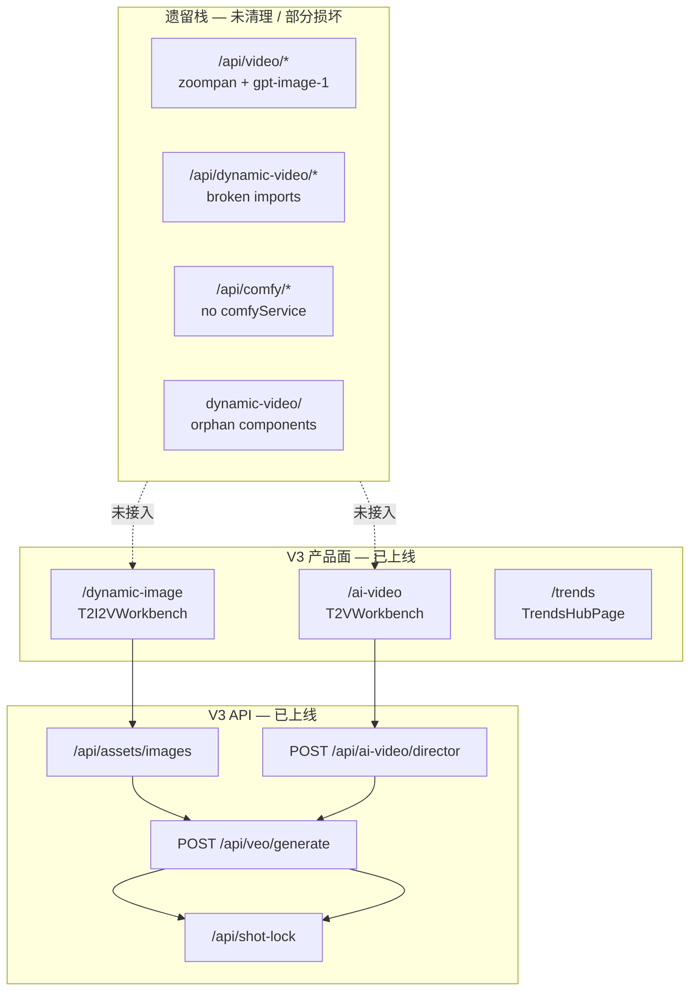
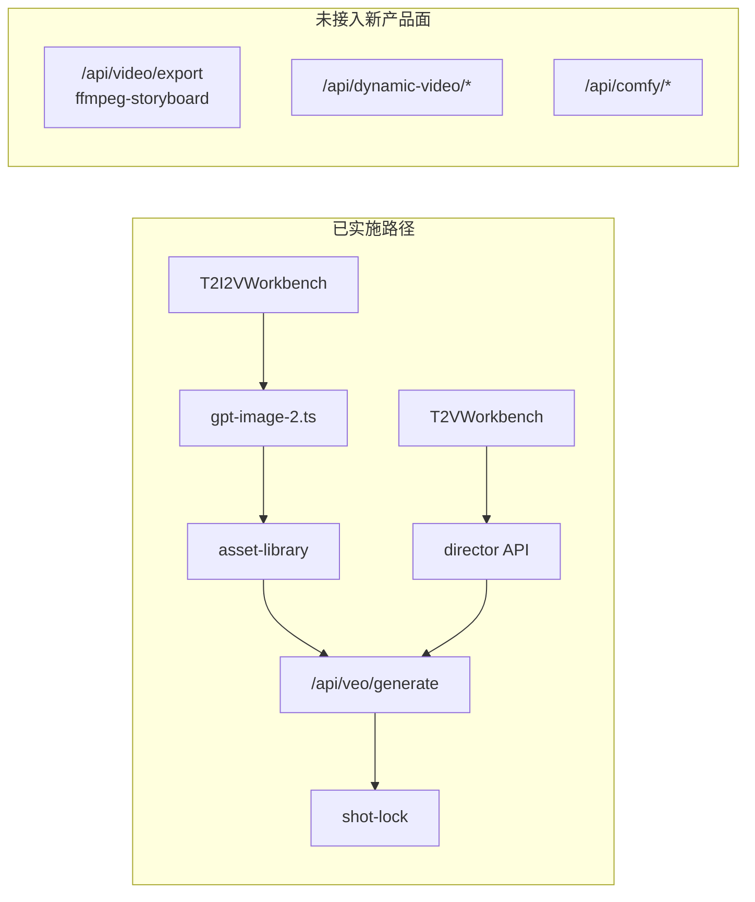

# AI 视频工作台 — V3 重构方案

> 版本：**V3.1**（规划 + 现状审计）  
> 日期：2026-05-27  
> 性质：**只读分析 + 重构设计** — 本文档不修改业务代码  
> 依据：`/Users/mac/ai-workspace` 当前代码库扫描 + 已确定 V3 产品原则

---

## 文档说明

| 版本 | 状态 |
|------|------|
| V3.0 | 纯规划，以 V2 为「当前」基线 |
| **V3.1（本文）** | 在 V3 **部分落地** 后重新审计：区分 **已实施 / 进行中 / 未开始 / 遗留待删** |

**V3 产品目标未变**；代码库处于 **「新壳已上线 + 旧栈未清干净」** 的过渡态。

---

## 目录

1. [目标架构总览](#1-目标架构总览)
2. [当前代码库结构（审计快照）](#2-当前代码库结构审计快照)
3. [实施进度矩阵](#3-实施进度矩阵)
4. [当前 vs 目标差异（更新）](#4-当前-vs-目标差异更新)
5. [需要新增模块](#5-需要新增模块)
6. [需要删除 / 清理模块](#6-需要删除--清理模块)
7. [需要保留模块](#7-需要保留模块)
8. [数据库 / 存储结构](#8-数据库--存储结构)
9. [API 全景与调整](#9-api-全景与调整)
10. [UI 调整](#10-ui-调整)
11. [Shot Lock 系统设计](#11-shot-lock-系统设计)
12. [测试模式 vs 正式模式](#12-测试模式-vs-正式模式)
13. [Veo 统一引擎设计](#13-veo-统一引擎设计)
14. [两条业务流水线](#14-两条业务流水线)
15. [实施顺序（P0 / P1 / P2 — 更新）](#15-实施顺序p0--p1--p2--更新)
16. [风险与未决项](#16-风险与未决项)

---

## 1. 目标架构总览

```
AI视频工作台
│
├── AI动态图片（T2I2V）
│     主题 → GPT-Image-2 → 图片库 → Veo(3s测试) → Shot Lock → Veo(8–12s正式)
│
├── AI视频（T2V）
│     主题 → GPT导演流水线 → Veo(3s测试) → Shot Lock → Veo(8–12s正式)
│
└── 热点中心
      TikTok Trends + YouTube Trends（统一入口）
```

### 已确定原则

| # | 原则 |
|---|------|
| 1 | **仅 Veo** — 唯一视频引擎，移除 Kling / ComfyUI / zoompan |
| 2 | **不依赖 Lite→Fast→Quality 100% 继承** — 测试与正式通过 Shot Lock 显式绑定 |
| 3 | **测试 + 正式双模式** — 3s 预览 → 锁定 → 8–12s 正式 |
| 4 | **Shot Lock** — 9 字段不可变快照 |
| 5 | **GPT-Image-2** — T2I2V 图像模型 |
| 6 | **Director Pipeline** — T2V 文本侧 |

---

## 2. 当前代码库结构（审计快照）

### 2.1 导航与页面（✅ 已达 V3 目标）

定义：`app/lib/nav-config.ts`

| 导航 | 路由 | 组件 |
|------|------|------|
| AI动态图片 | `/dynamic-image` | `T2I2VWorkbench` |
| AI视频 | `/ai-video` | `T2VWorkbench` |
| 热点中心 | `/trends` | `TrendsHubPage` |

**遗留重定向（仍保留）：**

| 旧路由 | 行为 | 文件 |
|--------|------|------|
| `/` | → `/dynamic-image` | `app/page.tsx` |
| `/dynamic-video`, `/image-mix` | → `/dynamic-image` | `app/dynamic-video/page.tsx`, `app/image-mix/page.tsx` |
| `/tiktok-trends`, `/youtube-trends` | → `/trends` | 对应 `page.tsx` |

### 2.2 目录树（当前有效 + 遗留并存）

```
ai-workspace/
├── app/
│   ├── dynamic-image/page.tsx          ✅ T2I2V
│   ├── ai-video/page.tsx               ✅ T2V
│   ├── trends/page.tsx                 ✅ 热点中心
│   │
│   ├── api/
│   │   ├── veo/generate/               ✅ V3 统一 Veo
│   │   ├── shot-lock/                  ✅ Shot Lock CRUD
│   │   ├── assets/images/              ✅ GPT-Image-2 + 图片库
│   │   ├── ai-video/director/          ✅ Director 流水线
│   │   ├── ai-video/generate*          ⚠️ @deprecated 包装
│   │   ├── video/*                     ⚠️ 遗留 zoompan + gpt-image-1
│   │   ├── dynamic-video/*             ❌ 遗留，部分 import 已断
│   │   └── comfy/*                     ❌ 遗留，comfyService 已删 → 运行时 broken
│   │
│   ├── components/workflows/
│   │   ├── t2i2v/T2I2VWorkbench.tsx    ✅
│   │   ├── t2v/T2VWorkbench.tsx          ✅
│   │   ├── shared/                     ✅ GenerationModeToggle, ShotLockPanel
│   │   └── dynamic-video/*             ❌ 孤儿组件（无页面引用）
│   │
│   └── lib/
│       ├── veo/                        🟡 薄封装（generate + first-frame）
│       ├── shot-lock/                  ✅ JSON 存储
│       ├── asset-library/              ✅
│       ├── generation-mode/            ✅
│       ├── image/gpt-image-2.ts        ✅
│       ├── director/                   ✅
│       ├── v3/data-dir.ts              ✅ .data JSON 读写
│       ├── video/providers/veo-*       🟡 真实 API 客户端仍在此
│       ├── comfy/                      ❌ 遗留未删
│       ├── workflows/dynamic-video/    ❌ 遗留未删
│       ├── ffmpeg-storyboard.ts        ❌ zoompan 遗留
│       └── ffmpeg-dynamic-export.ts    ❌ 动态视频导出遗留
│
├── public/
│   ├── assets/                         ✅ images / test-clips / production-clips / first-frames
│   ├── dynamic-videos/                 ❌ 旧 Comfy/mock 样片
│   ├── outputs/                        ❌ 旧 gpt-image-1 输出
│   └── exports/                        ✅ 最终导出（保留）
│
├── .data/                              ✅ 运行时 JSON（gitignore）
│   ├── shot-locks.json
│   ├── image-assets.json
│   ├── first-frame-assets.json
│   └── video-clip-assets.json
│
└── services/                           ✅ 已空（comfyService 已移除）
```

### 2.3 架构关系图（当前实际）



---

## 3. 实施进度矩阵

| V3 能力 | 目标 | 当前状态 | 完成度 |
|---------|------|----------|--------|
| 导航 3 项 | 3 模块 | ✅ `nav-config.ts` | 100% |
| T2I2V 工作台 | 完整流水线 | 🟡 MVP 单镜头 | 40% |
| T2V 工作台 | Director + Veo | 🟡 MVP 单镜头 active | 45% |
| 热点中心 | Tab 合并 | ✅ `TrendsHubPage` | 90% |
| 仅 Veo 引擎 | 无 Kling/Comfy | 🟡 新产品面是；遗留 API 仍在 | 60% |
| Shot Lock 9 字段 | 核心系统 | 🟡 类型 + JSON + UI；校验不完整 | 65% |
| 测试/正式模式 | 3s → 8–12s | ✅ API + Toggle | 80% |
| GPT-Image-2 | 替代 gpt-image-1 | 🟡 新路径有；旧 API 仍 gpt-image-1 | 70% |
| 图片库 | 结构化资产 | ✅ `asset-library` + API | 75% |
| 首帧提取 | FFmpeg | ✅ `veo/first-frame.ts` | 70% |
| Veo 真实 API | 端到端验证 | ❌ 代码有，未验证 | 30% |
| Veo I2V 真图输入 | image 条件生成 | ❌ 当前为 prompt 附加 assetId | 20% |
| 多镜头 | 批量 test/lock/prod | ❌ T2V 仅 UI 切换镜头 | 15% |
| Character/Camera Profile | 独立实体 + CRUD | ❌ 仅 lock snapshot 类型 | 10% |
| 导出合成 | final.mp4 | ❌ 未接 T2I2V/T2V | 0% |
| SQLite 存储 | `.data/v3.db` | ❌ 仍为 JSON 文件 | 0% |
| 遗留代码清理 | P2 删除 | ❌ comfy/dynamic-video 仍在 | 20% |

**P0 文档原目标（单镜 Director → 3s → Lock → 8s）**：UI/API **骨架具备**，依赖 `VEO_API_KEY` 与真实 MP4 方可验收。

---

## 4. 当前 vs 目标差异（更新）

### 4.1 与 V3.0 规划时的对比

| 维度 | V3.0 规划时（V2 基线） | 当前代码库（V3.1） | V3 终态目标 | 剩余差距 |
|------|----------------------|-------------------|------------|----------|
| 导航 | 4 项 | **3 项** ✅ | 3 项 | 低 |
| AI动态图片 | 双 Tab 混剪+Comfy | **T2I2VWorkbench** | 完整 T2I2V 流水线 | 中 |
| AI视频 | Mock UI | **T2VWorkbench + Director** | 多镜 + 导出 | 中 |
| 视频引擎 | Veo+Kling+Comfy+zoompan | 新产品 **仅 Veo**；遗留 API 仍在 | 仅 Veo | 中（清债） |
| Shot Lock | 不存在 | **JSON + API + UI** | 完整校验 + Profile | 中 |
| 存储 | localStorage 散落 | **.data JSON + public/assets** | SQLite | 中 |
| Director | API only | **API + T2V UI** ✅ | + Profile 注入 | 低 |

### 4.2 技术路径（当前实际）



---

## 5. 需要新增模块

> 下列模块中，**粗体**表示 V3.1 审计时尚未存在或仅有占位。

| 模块 | 路径 | V3.1 状态 |
|------|------|-----------|
| 统一 Veo 客户端完整树 | `app/lib/veo/{client,t2v,i2v,extend}.ts` | 🟡 仅有 `generate.ts` |
| **Character Profile** | `app/lib/character-profile/` | ❌ |
| **Camera Profile** | `app/lib/camera-profile/` | ❌ |
| **T2I2V 步骤编排** | `app/lib/workflows/t2i2v/` | ❌ |
| **T2V 步骤编排** | `app/lib/workflows/t2v/` | ❌ |
| **V3 项目存储** | `app/lib/projects/v3-project-store.ts` | ❌ |
| **ImageLibraryGrid** | `components/asset-library/` | ❌ |
| **FirstFrameViewer** | `components/workflows/shared/` | ❌ |
| **Veo 异步状态** | `/api/veo/status/:taskId` | ❌ |
| **Veo extend** | `/api/veo/extend` | ❌ |
| **热点聚合 API** | `/api/trends` | ❌ |
| **T2I2V / T2V 导出** | `/api/t2i2v/export`, `/api/t2v/export` | ❌ |

---

## 6. 需要删除 / 清理模块

> V3.1：**磁盘上仍存在**，与 V3.0 删除清单一致，优先级 P2。

| 类别 | 路径 | 当前状态 |
|------|------|----------|
| Comfy lib | `app/lib/comfy/*` | ❌ 仍在 |
| Comfy API | `app/api/comfy/*` | ❌ 仍在（**broken**：无 `services/comfyService.ts`） |
| Dynamic-video API | `app/api/dynamic-video/*` | ❌ 仍在（**broken**：无 `generate-scene-core.ts`） |
| Dynamic-video UI | `app/components/workflows/dynamic-video/*` | ❌ 孤儿 |
| Dynamic-video lib | `app/lib/workflows/dynamic-video/*` | ❌ 孤儿 |
| Zoompan 导出 | `app/lib/ffmpeg-storyboard.ts` + `/api/video/export` | ❌ 仍在 |
| 旧 gpt-image-1 批量 API | `/api/video/storyboard/images` | ❌ 仍在 |
| Mock 动态视频 | `app/lib/ai-video/providers/mock.ts` → `dynamic-videos/` | ⚠️ 仍存在 |
| 样片目录 | `public/dynamic-videos/*.mp4` | ❌ 仍在仓库 |
| RunPod Comfy 脚本 | `scripts/run-comfyui.sh` | 需确认是否在仓 |

**Kling**：`app/lib/video/providers/kling-*` 已移除 ✅

---

## 7. 需要保留模块

| 模块 | 路径 | V3.1 状态 | 后续 |
|------|------|-----------|------|
| Director Pipeline | `app/lib/director/*` | ✅ 使用中 | 扩展 Profile |
| Veo API Client | `app/lib/video/providers/veo-api-client.ts` | ✅ | 迁入 `app/lib/veo/` |
| Veo Config/Storage | `veo-config.ts`, `veo-storage.ts` | ✅ | 合并 |
| Export 基础设施 | `ffmpeg-dynamic-export`, `export-progress`, `getExportDirectory` | ✅ 存在 | 接 T2V 多镜 |
| Export UI | `ExportDownloadActions`, `ExportProgressPanel` | ✅ | 接新工作台 |
| OpenAI 封装 | `openai-key.ts`, `director-chat.ts` | ✅ | — |
| Trends 页 | `TikTokTrendsPage`, `YouTubeTrendsPage` | ✅ | — |
| `/exports/*` 下载 | `app/exports/[...path]/route.ts` | ✅ | — |
| Pipeline UI 骨架 | `PipelineRunContext`, `PipelineStepContent` | ⚠️ Shell 包裹但未用 | 复用或删 |

---

## 8. 数据库 / 存储结构

### 8.1 当前实现（JSON 文件）

| 文件 | 实体 | 模块 |
|------|------|------|
| `.data/shot-locks.json` | Shot Lock 记录 | `shot-lock/store.ts` |
| `.data/image-assets.json` | 图片元数据 | `asset-library/store.ts` |
| `.data/first-frame-assets.json` | 首帧元数据 | 同上 |
| `.data/video-clip-assets.json` | 测试/正式 clip | 同上 |

媒体文件：`public/assets/{images,first-frames,test-clips,production-clips}/`

### 8.2 V3 终态目标（SQLite — 未实施）

规划表结构不变：`projects` / `shots` / `shot_locks` / `image_assets` / `character_profiles` / `camera_profiles`（详见 V3.0 §6.2）。

**迁移建议（P1）**：JSON → SQLite 一次性 import；保留 JSON 只读备份。

---

## 9. API 全景与调整

### 9.1 当前 API 清单（25 routes）

**V3 主路径（应保留并扩展）：**

| Method | Route | 文件 |
|--------|-------|------|
| POST | `/api/veo/generate` | `app/api/veo/generate/route.ts` |
| POST/GET/DELETE | `/api/shot-lock` | `app/api/shot-lock/route.ts` |
| GET/POST | `/api/assets/images` | `app/api/assets/images/route.ts` |
| POST | `/api/ai-video/director` | `app/api/ai-video/director/route.ts` |

**Deprecated 包装：**

| Route | 说明 |
|-------|------|
| `/api/ai-video/generate` | → `generateWithVeo` |
| `/api/ai-video/generate-scene` | → 同上 |

**Trends：**

| Route | 说明 |
|-------|------|
| `/api/tiktok/trends`, `/api/youtube/trends` | 未聚合 |

**遗留（应删除或 410）：**

| 前缀 | 问题 |
|------|------|
| `/api/video/*` | zoompan + gpt-image-1 |
| `/api/dynamic-video/*` | broken imports |
| `/api/comfy/*` | missing comfyService |

### 9.2 统一 Veo API 契约（已实现 — `POST /api/veo/generate`）

```typescript
// 请求
{
  shotId: string;
  mode: "test" | "production";
  type: "t2v" | "i2v";
  prompt: string;
  durationSec?: number;
  aspectRatio?: "9:16" | "16:9";
  model?: string;
  seed?: number;
  imageAssetId?: string;   // i2v
  shotLockId?: string;       // production 必填
}

// 响应
{
  taskId, status, videoUrl, firstFrameUrl?, firstFrameAssetId?,
  provider: "veo", mode, type, seed, simulated?, error?
}
```

**缺口：** production 模式对 `firstFrameAssetId` 的 lock 校验未强制；I2V 未传真实 image bytes 给 Veo API。

---

## 10. UI 调整

### 10.1 已实施

| 组件 | 文件 | 能力 |
|------|------|------|
| T2I2VWorkbench | `workflows/t2i2v/T2I2VWorkbench.tsx` | 生图 → 测试 → 锁定 → 正式（单镜） |
| T2VWorkbench | `workflows/t2v/T2VWorkbench.tsx` | Director → 多 prompt UI → 单镜 test/lock/prod |
| GenerationModeToggle | `shared/GenerationModeToggle.tsx` | 测试 / 正式 |
| ShotLockPanel | `shared/ShotLockPanel.tsx` | 锁定字段展示 |
| TrendsHubPage | `trends/TrendsHubPage.tsx` | TikTok / YouTube Tab |

### 10.2 未实施（V3 终态）

- 完整步骤条（脚本 / 分镜 / 字幕 / 配音 / 导出）
- `ImageLibraryGrid`、`FirstFrameViewer`、`VeoGenerationProgress`（SSE）
- Character/Camera Profile 编辑器
- 多镜头 Shot Lock 状态机（每镜独立 lock）
- 批量「全部测试 / 全部正式」

---

## 11. Shot Lock 系统设计

### 11.1 九字段（产品要求）

| 字段 | V3.1 实现 |
|------|-----------|
| ShotID | ✅ `shotId` |
| Prompt | ✅ |
| Seed | ✅ |
| FirstFrame | ✅ `firstFrameAssetId` + `firstFrameUrl` |
| Duration | ✅ |
| AspectRatio | ✅ |
| Model | ✅ |
| CharacterProfile | 🟡 类型有，UI/API 未填 |
| CameraProfile | 🟡 类型有，UI/API 未填 |

### 11.2 锁定流程（已实现）

```
Veo test(3s) → firstFrame 提取（真实 MP4 时）→ 用户确认 → POST /api/shot-lock → production 需 shotLockId
```

### 11.3 正式校验缺口

- `validateProductionRequest` 未校验 `firstFrameAssetId`
- Mock 模式下允许锁定（`simulated: true` 应禁止 lock）
- 解锁后正式 clip 作废 — API 有 DELETE，UI 有解锁按钮 ✅

---

## 12. 测试模式 vs 正式模式

| 模式 | 时长（UI/API） | V3.1 |
|------|---------------|------|
| test | 3s（Veo API 最小 4s 映射） | ✅ `generation-mode` + Toggle |
| production | 8s 默认（可扩展 10/12） | ✅ `DEFAULT_PRODUCTION_DURATION_SEC=8` |

环境变量：见 `.env.example` — `VEO_API_KEY`, `VEO_USE_MOCK`（dev only）

---

## 13. Veo 统一引擎设计

### 13.1 当前分层

```
T2I2VWorkbench / T2VWorkbench
        ↓
POST /api/veo/generate
        ↓
app/lib/veo/generate.ts          ← V3 编排层
        ↓
app/lib/video/providers/veo-api-client.ts   ← HTTP + 轮询
mock-veo-provider.ts             ← 无 Key 时回退
```

### 13.2 终态目标

合并为 `app/lib/veo/{client,t2v,i2v,extend,storage}.ts`，删除 `mock` 生产路径，I2V 传 `image.bytesBase64Encoded`。

---

## 14. 两条业务流水线

### 14.1 T2I2V（当前 MVP）

```
主题 → POST /api/assets/images (GPT-Image-2) → POST /api/veo/generate (i2v, test)
     → POST /api/shot-lock → POST /api/veo/generate (i2v, production)
```

**缺失：** 脚本/分镜、多镜、导出、字幕/配音。

### 14.2 T2V（当前 MVP）

```
主题 → POST /api/ai-video/director → 选镜头 → test → lock → production
```

**缺失：** 每镜独立 lock 持久化、FFmpeg concat、导出。

---

## 15. 实施顺序（P0 / P1 / P2 — 更新）

基于 V3.1 审计，**重新排序剩余工作**（✅ = 已完成）。

### P0 — 剩余必做（阻塞验收）

| # | 任务 | 状态 |
|---|------|------|
| P0-1 | **Veo 真实 API E2E**（配置 Key，跑通 test + production，磁盘有 MP4） | ❌ |
| P0-2 | **Veo I2V 真图输入**（非 prompt 拼接 assetId） | ❌ |
| P0-3 | **禁止 simulated 锁定** | ❌ |
| P0-4 | **补全 production lock 校验**（含 firstFrame） | ❌ |
| ✅ | 导航 3 项 | 完成 |
| ✅ | Shot Lock JSON + API | 完成 |
| ✅ | test/production API | 完成 |
| ✅ | GPT-Image-2 新路径 | 完成 |
| ✅ | T2V/T2I2V MVP UI | 完成 |

### P1 — 完整流水线

| # | 任务 |
|---|------|
| P1-1 | 多镜头：每镜独立 Shot Lock + 状态机 |
| P1-2 | T2V FFmpeg concat + `/api/t2v/export` |
| P1-3 | T2I2V 完整步骤（脚本/分镜/字幕/配音） |
| P1-4 | CharacterProfile / CameraProfile CRUD + Director 注入 |
| P1-5 | Veo 异步 `/api/veo/status` + SSE 进度 UI |
| P1-6 | SQLite 迁移（`.data/v3.db`） |
| P1-7 | ImageLibraryGrid / FirstFrameViewer |

### P2 — 清债与优化

| # | 任务 |
|---|------|
| P2-1 | 删除 `app/lib/comfy/`, `/api/comfy/*` |
| P2-2 | 删除 `/api/dynamic-video/*`, `workflows/dynamic-video/`, orphan UI |
| P2-3 | 删除 `/api/video/export` zoompan 路径或 410 |
| P2-4 | 删除 `public/dynamic-videos/` 样片 |
| P2-5 | 合并 `video/providers/veo-*` → `app/lib/veo/` |
| P2-6 | RunPod 部署去掉 ComfyUI 8188 依赖 |

---

## 16. 风险与未决项

| 风险 | 说明 | 缓解 |
|------|------|------|
| 遗留 API broken | comfy/dynamic-video 路由可 500 | P2 删除或 410 |
| Veo 未验证 | 产品声称 V3 但无真实视频证据 | P0-1 立即验收 |
| Mock lock | 用户可能锁定无效测试 | P0-3 |
| I2V 假实现 | T2I2V 名不副实 | P0-2 |
| 双栈并存 | 维护成本高、新人困惑 | P2 清债 + 文档 |
| Veo 3s vs API 4s | UI 写 3s，API 映射 4s | 文档/UI 对齐 |

### 未决产品问题

- 正式时长默认 8 / 10 / 12 如何选？
- Veo extend vs 二次 generate — 以 Shot Lock 约束为准
- 热点 → 一键填充主题 — P2 可选

---

## 附录 A：V3.0 → V3.1 变更记录

| 项 | V3.0 文档描述 | V3.1 实际 |
|----|--------------|-----------|
| 性质 | 规划 only | **部分已实施** |
| 当前基线 | V2 四套引擎 | V3 壳 + 遗留栈 |
| Director UI | 未接 | **T2VWorkbench 已接** |
| Shot Lock | 不存在 | **JSON + API + UI** |
| 导航 | 4 项 | **3 项** |
| Kling | 待删 | **已删** |
| Comfy | 待删 | **仍在（broken）** |

---

## 附录 B：快速验收清单（不改代码）

```bash
# 1. 配置
# .env.local: OPENAI_API_KEY, VEO_API_KEY

# 2. T2V 单镜
curl -X POST localhost:3000/api/ai-video/director -H 'Content-Type: application/json' -d '{"topic":"测试","shotCount":1}'
# → 取 prompts[0].providerPrompt

curl -X POST localhost:3000/api/veo/generate -H 'Content-Type: application/json' \
  -d '{"shotId":"t2v-1","mode":"test","type":"t2v","prompt":"..."}'

# 3. 锁定 + 正式（需上一步 seed/videoUrl/firstFrame）

# 4. T2I2V
curl -X POST localhost:3000/api/assets/images -H 'Content-Type: application/json' -d '{"prompt":"..."}'
```

成功标准：`.data/*.json` 有记录，`public/assets/` 有 MP4/PNG，且 **非** `simulated: true`（真实 Veo）。

---

*文档结束 — AI 视频工作台 V3.1（规划 + 现状审计，未修改业务代码）*
