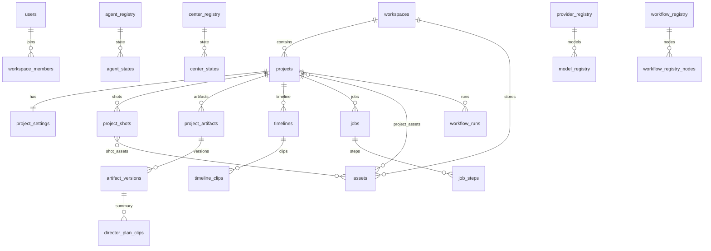

# AI Cut V1 — 数据库设计总览（迁移方案 · 审核版）

> **状态**：仅方案与 Schema 定稿。**禁止迁移、禁止双写、禁止切换数据库、禁止修改业务代码。**  
> **下一门控**：人工完成 `migrations/AUDIT_GATE.md` 全部勾选后，方可进入 Phase M0（建空库）。

---

## 底层设计原则（四条主线）

> 后续新增任何 Center、Agent 或 AI 模型 **尽量遵循**，**不需要再调整核心数据库结构**。

| 主线 | 唯一职责 | 核心表 | 禁止 |
|------|----------|--------|------|
| **Project** | 唯一业务主线 | `projects`, `project_settings`, `project_artifacts`, `project_shots` | 无 `project_id` 的业务数据 |
| **Asset** | 唯一媒体主线 | `assets`, `shot_assets`, `project_assets` | 二进制进 PG；各 Center 私有媒体表 |
| **Job** | 唯一任务主线 | `jobs`, `job_steps`, `workflow_runs` | 散落任务表；Center 自建 job 存储 |
| **Registry** | 唯一扩展主线 | `*_registry`（18 表） | 为扩展改 `projects` 结构；硬编码 slug |

**Center 调用链（数据层）**：

```text
Agent → Center → Engine → Timeline → OpenCut
```

Center **禁止** 互调；共享数据只经 **Project / Asset / Job / Timeline / Artifact**。

---

## ① 数据库目录结构

```text
database/
├── README.md                      # 入口说明
├── DATABASE_DESIGN.md             # 本文件（15 项交付总览）
├── DATABASE_REVIEW.md             # 只读审查报告（97 表 + 6 视图）
├── DESIGN.md                      # 第一阶段设计定稿（历史）
├── schema/                        # DDL — 初始 Schema（未部署 = 未迁移）
│   ├── 000_init.sql               # 一键执行入口
│   ├── 001_extensions.sql
│   ├── 010_identity.sql           # Identity（4）
│   ├── 020_registry.sql           # Registry（18）
│   ├── 030_project.sql            # Project（18）
│   ├── 040_library.sql            # Library（22）
│   ├── 050_assets.sql             # Asset（2 + 6 VIEW）
│   ├── 060_timeline.sql           # Timeline（8）
│   ├── 070_execution.sql          # Execution（11）
│   ├── 080_qa.sql                 # QA（4）
│   ├── 090_export.sql             # Export（2）
│   ├── 100_cost.sql               # Cost（3）
│   ├── 110_logs.sql               # Logs（5）
│   └── 999_indexes.sql            # 延迟 FK + 索引
├── migrations/                    # 迁移方案（本阶段无 DML）
│   ├── README.md
│   ├── AUDIT_GATE.md              # 人工审核门控 ★
│   ├── schema/README.md           # 增量 DDL 规划
│   └── data/README.md             # 数据迁移脚本占位（禁止执行）
├── seeders/
│   └── 001_registry.sql           # Registry 预置
├── repositories/
│   ├── README.md
│   └── interfaces.ts              # Repository 契约（无 PG 实现）
├── mapping/
│   └── json-to-database.md        # JSON ↔ 表映射
└── docs/
    ├── migration-plan.md          # 分阶段迁移计划
    ├── risk-analysis.md           # 风险分析
    ├── object-storage.md          # 对象存储布局
    └── redis.md                   # Redis 约定
```

---

## ② Schema

### 分层与文件

| 层 | SQL 文件 | 表数 | 职责 |
|----|----------|------|------|
| Identity | `010_identity.sql` | 4 | 用户、工作空间、成员、权限 |
| Registry | `020_registry.sql` | 18 | Agent/Center/Model/Workflow 等扩展注册 |
| Project | `030_project.sql` | 18 | 项目、Artifact、Workbench、Canvas |
| Library | `040_library.sql` | 22 | 素材、角色、模板、术语库 |
| Asset | `050_assets.sql` | 2 + 6 VIEW | 统一媒体元数据 |
| Timeline | `060_timeline.sql` | 8 | 四轨时间线、转场、MediaPool |
| Execution | `070_execution.sql` | 11 | Job、Workflow、Clip Agent、Plan 摘要 |
| QA | `080_qa.sql` | 4 | 质检报告、问题、日志 |
| Export | `090_export.sql` | 2 | 导出、发布（预留） |
| Cost | `100_cost.sql` | 3 | 费用、用量、legacy 映射 |
| Logs | `110_logs.sql` | 5 | Activity/Center/Agent/History/Settings |
| 索引 | `999_indexes.sql` | — | 延迟 FK + 复合索引 |

### 初始化（审核通过后手动）

```bash
createdb ai_cut_v1
psql "$DATABASE_URL" -f database/schema/000_init.sql
psql "$DATABASE_URL" -f database/seeders/001_registry.sql
```

---

## ③ Migration

### 当前阶段

| 类型 | 状态 | 说明 |
|------|------|------|
| Schema DDL | ✅ 已编写 | `schema/*.sql`，**未执行** |
| Registry Seed | ✅ 已编写 | `seeders/001_registry.sql` |
| 增量 DDL | ⏸ 空 | `migrations/schema/` 待审核后 |
| 数据 DML | ❌ 禁止 | `migrations/data/` 禁止添加可执行脚本 |

### 命名规范（审核后）

```text
migrations/schema/M001__add_xxx.sql      # 结构变更
migrations/data/D001__import_materials.sql  # 数据导入
```

### 与 JSON 关系

- 迁移前：**JSON / localStorage 为 SoT**
- 迁移后：JSON **保留只读备份**，不删除
- `legacy_json_mappings` 仅在数据迁移批次写入

详见 `migrations/README.md`、`docs/migration-plan.md`。

---

## ④ ER 图

### 核心主线



### 四条主线在 ER 中的位置

```text
Registry（扩展） ──slug 引用──► Project（业务）
                                    │
                    ┌───────────────┼───────────────┐
                    ▼               ▼               ▼
                 Asset（媒体）   Timeline（执行态）  Job（任务）
```

完整 ER 见 `DATABASE_REVIEW.md` §5。

---

## ⑤ Repository 结构

### 强制规则

```text
app/api/*          ──┐
app/lib/*-center/* ──┼──► IXxxRepository ──► PostgreSQL
app/components/*   ──┘         ▲
                               │
                    database/repositories/pg/*.ts    （审核后实现）
                               │
                    database/repositories/legacy/*.ts （JSON 只读适配）
```

- **禁止** `app/` 下 `import pg`、raw SQL
- **禁止** Center 互读写对方私有表
- 共享只经 `IProjectRepository` / `IArtifactRepository` / `IJobRepository` / `IAssetRepository`

### 目录规划

```text
database/repositories/
├── interfaces.ts          # ✅ 契约（Identity/Registry/Project/Artifact/Library/Asset/Timeline/Job/QA/Export/Cost/Log）
├── pg/                    # ⏸ PostgreSQL 实现
│   ├── project-repository.ts
│   ├── asset-repository.ts
│   ├── artifact-repository.ts
│   ├── job-repository.ts
│   └── ...
├── legacy/                # ⏸ JSON 只读适配
│   ├── production-json-adapter.ts
│   └── workbench-local-adapter.ts
└── factory.ts             # createRepositoryBundle()
```

### 接口清单（已实现契约）

| 接口 | 职责 |
|------|------|
| `IUserRepository` / `IWorkspaceRepository` | Identity |
| `IRegistryRepository` | 全部 Registry 只读 |
| `IProjectRepository` / `IProjectSettingsRepository` / `IProjectShotRepository` | Project 主线 |
| `IWorkbenchSessionRepository` | UI + syncVersion |
| `IArtifactRepository` | Plan/Graph 版本 |
| `IMaterialRepository` / `ICharacterRepository` / … | Library |
| `IAssetRepository` | Asset 主线 |
| `ITimelineRepository` | Timeline 投影 |
| `IJobRepository` / `IWorkflowRunRepository` | Job 主线 |
| `IQaRepository` / `IExportRepository` / `ICostRepository` / `ILogRepository` | 横切 |

详见 `repositories/interfaces.ts`、`repositories/README.md`。

---

## ⑥ 全部数据表（97 表 + 6 视图）

### Identity（4）

`users`, `workspaces`, `workspace_members`, `workspace_permissions`

### Registry（18）

`agent_registry`, `center_registry`, `provider_registry`, `model_registry`, `workflow_registry`, `workflow_registry_nodes`, `workflow_registry_edges`, `pipeline_registry`, `module_registry`, `engine_registry`, `job_registry`, `template_registry`, `resource_registry`, `artifact_registry`, `integration_registry`, `capability_registry`, `permission_registry`, `provider_credentials`

### Project（18）

`projects`, `project_settings`, `project_resources`, `project_assets`, `project_artifacts`, `artifact_versions`, `workbench_sessions`, `center_configs`, `center_states`, `agent_configs`, `agent_states`, `agent_prompts`, `agent_prompt_versions`, `project_shots`, `project_director_state`, `canvas_nodes`, `canvas_edges`, `canvas_sections`

### Library（22）

`materials`, `material_analyses`, `material_scripts`, `material_schedules`, `script_evolution_runs`, `script_evolution_records`, `characters`, `scenes`, `props`, `prompts`, `templates`, `template_versions`, `music_library`, `effects_library`, `voice_library`, `subtitle_library`, `glossaries`, `glossary_entries`, `storyboard_shots`, `provider_prompts`, `shot_locks`, `shot_timeline_entries`

### Asset（2 + 6 VIEW）

**表**：`assets`, `shot_assets`  
**视图**：`image_assets`, `video_assets`, `audio_assets`, `thumbnail_assets`, `export_assets`, `subtitle_assets`

### Timeline（8）

`timelines`, `timeline_tracks`, `timeline_clips`, `timeline_transitions`, `timeline_markers`, `clip_effects`, `script_segments`, `timeline_media_pool`

### Execution（11）

`jobs`, `job_steps`, `workflow_runs`, `workflow_run_logs`, `clip_agent_runs`, `clip_agent_commands`, `clip_intents`, `director_plan_clips`, `director_plan_subtitles`, `opencut_projects`, `edit_plan_variants`

### QA（4）

`qa_reports`, `qa_scores`, `qa_issues`, `qa_logs`

### Export（2）

`export_records`, `publish_records`（预留）

### Cost（3）

`cost_ledger`, `usage_stats_daily`, `legacy_json_mappings`

### Logs（5）

`activity_logs`, `center_logs`, `agent_logs`, `project_history_snapshots`, `module_settings`

**逐表说明** → `DATABASE_REVIEW.md` §3–4。

---

## ⑦ 外键关系

### 核心 FK 链（Project 为中心）

```text
workspaces ──► projects ──► project_settings
                │
                ├──► project_shots ──► shot_assets ──► assets
                ├──► project_artifacts ──► artifact_versions
                ├──► timelines ──► timeline_clips ──► assets
                ├──► jobs ──► job_steps
                └──► workflow_runs ──► workflow_run_logs

projects.source_material_id ──► materials
projects.final_video_asset_id ──► assets
projects.active_timeline_id ──► timelines
projects.active_*_artifact_id ──► project_artifacts
project_artifacts.active_version_id ──► artifact_versions
```

### Registry 层

- **无外键** 指向 Project
- 业务表通过 **slug** 引用 Registry（如 `job_type`, `artifact_kind`）
- 扩展 = **INSERT**，不改核心表结构

### 延迟 FK（999_indexes.sql）

部分 FK 在全部表创建后绑定，避免循环依赖：

- `projects` ↔ `materials`, `assets`, `timelines`, `project_artifacts`, `workflow_runs`
- `characters/scenes/props/music_library` → `assets`
- `jobs` → `workflow_runs`

完整 FK 列表见各 `schema/*.sql` 与 `999_indexes.sql`。

---

## ⑧ 索引设计

### 原则

| 原则 | 说明 |
|------|------|
| 租户隔离 | 复合索引 leading column = `workspace_id` |
| 软删 | `projects` 部分索引 `WHERE deleted_at IS NULL` |
| 媒体去重 | `UNIQUE (storage_bucket, storage_key)` |
| 版本查询 | `(artifact_id, version DESC)` |
| 任务队列 | `(project_id, status, created_at DESC)` |
| Registry | `slug` 单列索引 |

### 主要索引（999_indexes.sql）

| 索引 | 表 | 用途 |
|------|-----|------|
| `idx_projects_workspace_status` | projects | 项目列表 |
| `idx_projects_updated` | projects | 最近更新 |
| `idx_assets_workspace_kind` | assets | 按类型浏览 |
| `idx_assets_project` | assets | 项目媒体 |
| `idx_assets_storage_key` | assets | **唯一** storage 路径 |
| `idx_assets_sha256` | assets | 去重 |
| `idx_timeline_clips_timeline_track` | timeline_clips | 轨道排序 |
| `idx_jobs_project_status` | jobs | 项目任务 |
| `idx_jobs_workspace_type` | jobs | 按类型任务 |
| `idx_artifact_versions_artifact` | artifact_versions | 版本回退 |
| `idx_*_logs_project` | activity/center/agent logs | 日志查询 |
| `idx_cost_ledger_project` | cost_ledger | 费用 |
| `idx_shot_assets_project` | shot_assets | 镜头媒体 |
| `idx_registry_*_slug` | registry 表 | slug 查找 |

JSONB 大字段（`artifact_versions.payload`）**不做 GIN 全量索引**；摘要表（`director_plan_clips` 等）服务结构化查询。

---

## ⑨ 对象存储结构

> DB 只存 `assets` 元数据；二进制 **禁止** 写入 PostgreSQL。

```text
s3://{bucket}/                              # 默认: ai-cut
└── workspaces/{workspace_id}/
    ├── shared/
    │   ├── characters/{character_id}/{filename}
    │   ├── scenes/{scene_id}/{filename}
    │   ├── props/{prop_id}/{filename}
    │   ├── bgm/{asset_id}.{ext}
    │   ├── materials/{material_id}/attachments/
    │   └── templates/{template_id}/
    └── projects/{project_id}/
        ├── images/{asset_id}.{ext}
        ├── videos/{asset_id}.{ext}
        ├── audio/{asset_id}.{ext}
        ├── subtitles/{asset_id}.{ext}
        ├── exports/{export_id}/{filename}
        ├── thumbnails/{asset_id}.{ext}
        └── covers/{asset_id}.{ext}
```

**storage_key 示例**：

```text
workspaces/ws-uuid/projects/proj-uuid/videos/asset-uuid.mp4
```

开发环境可映射 `~/Desktop/AI-Veo/` → 同一抽象；`assets.legacy_filepath` 保留至迁移完成。

详见 `docs/object-storage.md`。

---

## ⑩ Redis 结构

> **本阶段不部署 Redis。** 热数据 / 队列 only；权威 SoT 仍在 PostgreSQL。

| 用途 | Key 模式 | TTL |
|------|----------|-----|
| Job 队列 | `queue:jobs:{type}` | — |
| Job 进度 | `job:progress:{id}` | 24h |
| SSE | `channel:job:{id}` | 1h |
| TTS/字幕缓存 | `cache:tts:{sha256}` | 7d |
| Rate limit | `rl:api:{ip}` | 1m |
| Shot Lock | `lock:shot:{project}:{shot}` | 30s |
| Workbench sync | `wb:sync:{project}:{user}` | 5m |
| Activity 热缓冲 | `stream:activity:{workspace}` | 异步落 PG |

**不进 Redis**：Project、Artifact 版本、cost_ledger、assets 元数据。

详见 `docs/redis.md`。

---

## ⑪ JSON 映射关系

### 桌面 JSON（~/Desktop/AI-Veo/Projects/）

| JSON | 目标表 |
|------|--------|
| `materials.json` | `materials`, `material_analyses`, `material_scripts` |
| `characters.json` / `scenes.json` / `props.json` | `characters` / `scenes` / `props` + `legacy_json_mappings` |
| `image-assets.json` | `assets` (kind=image) |
| `auto-edit-jobs.json` | `jobs` |
| `shot-locks.json` | `shot_locks` |
| `script-evolution-*.json` | `script_evolution_*` |
| `*-stats.json` | **不迁移**（可重算） |

### localStorage

| Key | 目标 |
|-----|------|
| `workbench:t2v` | **拆分** → `projects` + settings + artifacts + timelines + … |
| `workbench:history:*` | `project_history_snapshots` |
| `*-center:ui-settings` | `module_settings` |

### Workbench 字段（T2V）

| 字段 | 目标 |
|------|------|
| topic, shotCount, pipelineMode | `projects` + `project_settings` |
| director.storyboard[] | `storyboard_shots` |
| editGraph / directorPlan | `artifact_versions` + Timeline 投影 |
| shotFrames | `shot_assets` + `assets` |
| canvas* | `canvas_nodes/edges/sections` |
| canvasUi, *Loading | `workbench_sessions` **仅此** |

完整映射 → `mapping/json-to-database.md`。

---

## ⑫ 数据迁移计划

### 阶段门控

| 阶段 | 内容 | 读写 | 前置 |
|------|------|------|------|
| **P0** ✅ | Schema + Registry seed + Repository 契约 | 无 PG | — |
| **审核** ★ | `AUDIT_GATE.md` 签字 | — | P0 |
| **M0** | 建空库 + seed | JSON SoT | 审核通过 |
| **P1** | Repository pg/ 实现 | JSON only | M0 |
| **D1** | Workspace + 默认用户 | JSON SoT | P1 |
| **D2** | materials / characters / scenes / props | JSON SoT | D1 |
| **D3** | assets 扫盘索引 | JSON SoT | D2 |
| **D4** ⚠ | projects ← workbench 拆分 | **仍 JSON SoT** | D3 + 对账 |
| **D5** | artifact_versions + timelines | 影子读对比 | D4 |
| **D6** | jobs / history / cost | — | D5 |
| **P7** | 读切换 PG 为主 | **需另批** | D6 验证 |
| **P8** | 可选停 JSON 写 | **仍不删文件** | P7 |

### 明确禁止（审核前）

- ❌ 双写 localStorage + PG
- ❌ Feature flag 打开 `AI_CUT_DB_WRITE` / 读切换
- ❌ 执行 `migrations/data/*`
- ❌ 修改 `app/` 业务/API

### 迁移顺序

1. Registry seed  
2. Workspace + 用户  
3. assets（扫磁盘）  
4. materials / resources  
5. projects ← workbench:t2v  
6. artifact_versions ← Plan/Graph  
7. timelines 投影  
8. jobs ← auto-edit-jobs  
9. history / cost  

详见 `docs/migration-plan.md`、`migrations/README.md`。

---

## ⑬ 风险分析

| 等级 | 风险 | 缓解 |
|------|------|------|
| **高** | workbench 无 project_id | 全量 backup；建 `project_shots` UUID |
| **高** | shotIndex 作主键 | 保留 index 作排序，UUID 作主键 |
| **高** | 媒体无 JSON 索引 | D3 扫盘补 `assets` |
| **高** | 提前双写双 SoT | **审核前禁止双写** |
| **高** | 提前读切换 | 影子读 + 集成测试 |
| 中 | artifact ↔ timeline 不同步 | 单一写入路径 + 投影 job |
| 中 | Library 多套表分裂 | 迁移前拍板合并策略 |
| 低 | 97 表运维复杂度 | 索引 + 分库评估放 V2 |

完整矩阵 → `docs/risk-analysis.md`。

---

## ⑭ DATABASE_REVIEW.md

只读审查报告，含：

- 97 表 + 6 视图统计
- 逐表作用与分层
- ER 图
- 核心表 / 预留表
- 重叠设计与合并建议
- 审查结论

路径：`database/DATABASE_REVIEW.md`

---

## ⑮ 本文档

路径：`database/DATABASE_DESIGN.md`（本文件）

---

## 审核后下一步（不在本阶段执行）

1. 完成 `migrations/AUDIT_GATE.md` 签字  
2. Phase M0：手动建空库  
3. 实现 `repositories/pg/`  
4. 编写 `migrations/data/D00*.sql`（带 dry-run）  
5. D4 专项：workbench 拆分 + 对账  
6. **人工批准** 后讨论读切换 / 双写（若需要）

---

*文档版本：2026-06-29 · 仅方案，未执行任何迁移。*
