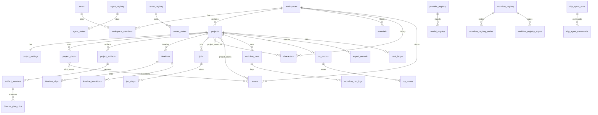

# AI Cut V1 数据库审查报告

> **审查范围**：仅 `database/` 目录（Schema SQL + 设计文档）。  
> **审查方式**：只读；**未修改任何 Schema / 代码 / 数据**。  
> **审查日期**：2026-06-29  
> **关联**：[DATABASE_DESIGN.md](./DATABASE_DESIGN.md) · [AUDIT_GATE.md](./migrations/AUDIT_GATE.md)

---

## 底层设计原则（四条主线）

| 主线 | 核心表 | 审查结论 |
|------|--------|----------|
| **Project** | `projects`, `project_artifacts`, `artifact_versions` | ✅ 业务锚点清晰 |
| **Asset** | `assets` + 6 VIEW | ✅ 统一媒体，无违规分包 |
| **Job** | `jobs`, `job_steps`, `workflow_runs` | ✅ 统一任务系统 |
| **Registry** | 18 张 `*_registry` | ✅ 扩展只 INSERT |

> 后续新增 Center/Agent/Model 应遵循四条主线，**无需调整核心 Schema**。

---

## 1. 一共有多少张表？

| 类型 | 数量 |
|------|------|
| **物理表（TABLE）** | **97** |
| **视图（VIEW）** | **6** |
| **合计数据库对象** | **103** |

> 视图均为 `assets` 表的语义分区，不重复存储数据。

---

## 2. 每张表的名称

见第 3、4 节分类清单（97 表 + 6 视图）。

---

## 3. 每张表的作用 & 4. 分层归属

### Identity（4 表）

| 表名 | 作用 |
|------|------|
| `users` | 平台用户账号 |
| `workspaces` | 工作空间 / 团队租户 |
| `workspace_members` | 成员与角色（owner/editor/viewer） |
| `workspace_permissions` | 成员权限实例（对应 permission_registry） |

---

### Registry（18 表）

| 表名 | 作用 |
|------|------|
| `agent_registry` | Agent 定义（slug、能力、默认模型） |
| `center_registry` | Center 定义（路由、绑定 Agent） |
| `provider_registry` | Provider 定义（OpenAI/Veo/FFmpeg/OpenCut…） |
| `model_registry` | Model Center：模型目录与定价 |
| `workflow_registry` | 工作流定义（可版本） |
| `workflow_registry_nodes` | 工作流节点（agent/center/gateway） |
| `workflow_registry_edges` | 工作流边与条件分支 |
| `pipeline_registry` | 14 步流水线阶段注册 |
| `module_registry` | 产品模块对照表（与代码 module-registry 对齐） |
| `engine_registry` | Rule/Render Engine 注册 |
| `job_registry` | 任务类型注册（veo/render/tts…） |
| `template_registry` | 模板**类型**注册（非模板实例） |
| `resource_registry` | 资源**类型**注册（character/scene/lora…） |
| `artifact_registry` | 可版本产物**类型**（director_plan/edit_graph…） |
| `integration_registry` | 第三方集成（YouTube/发布平台） |
| `capability_registry` | Agent/Center I/O Schema |
| `permission_registry` | 权限 slug 定义 |
| `provider_credentials` | Workspace 级 Provider 密钥（加密由应用层） |

---

### Project（18 表）

| 表名 | 作用 |
|------|------|
| `projects` | **系统业务锚点**：项目主记录 |
| `project_settings` | 镜头参数、一致性、剪辑引擎设置等 |
| `project_resources` | 项目 ↔ Library 资源 M:N 引用 |
| `project_assets` | 项目 ↔ 统一 Asset M:N 关联 |
| `project_artifacts` | 可版本产物容器（Plan/Graph 等） |
| `artifact_versions` | 产物版本快照（JSONB payload，可回退） |
| `workbench_sessions` | 客户端 Workbench：projectId + UI + syncVersion |
| `center_configs` | Center 运行配置（project/workspace 级） |
| `center_states` | Center 运行时状态 |
| `agent_configs` | Agent 运行配置 |
| `agent_states` | Agent 运行时状态 |
| `agent_prompts` | Agent Prompt 容器 |
| `agent_prompt_versions` | Agent Prompt 版本 |
| `project_shots` | 稳定镜头 UUID（替代 shotIndex 作主键） |
| `project_director_state` | 编导 title + 全文 script |
| `canvas_nodes` | 无限画布节点位置 |
| `canvas_edges` | 画布连线 |
| `canvas_sections` | 画布分区 |

---

### Library（22 表）

| 表名 | 作用 |
|------|------|
| `materials` | 素材库主表 |
| `material_analyses` | 素材 AI 分析（1:1） |
| `material_scripts` | 素材下生成的脚本 |
| `material_schedules` | 素材定时采集任务 |
| `script_evolution_runs` | 脚本进化运行 |
| `script_evolution_records` | 进化脚本归档 |
| `characters` | 角色库 |
| `scenes` | 场景库 |
| `props` | 道具库 |
| `prompts` | Prompt 实例库 |
| `templates` | 统一模板实例（kind 来自 template_registry） |
| `template_versions` | 模板版本 |
| `music_library` | BGM 元数据（文件指向 assets） |
| `effects_library` | 特效/转场预设元数据 |
| `voice_library` | 音色目录 |
| `subtitle_library` | 字幕样式/动画目录 |
| `glossaries` | 术语库容器 |
| `glossary_entries` | 术语条目 |
| `storyboard_shots` | 分镜明细（按 project，创作内容） |
| `provider_prompts` | 每镜 Provider Prompt |
| `shot_locks` | Veo 生产镜头锁定 |
| `shot_timeline_entries` | 一致性时间轴条目 |

> **归属说明**：`storyboard_shots`、`provider_prompts`、`shot_locks`、`shot_timeline_entries` 虽在 `040_library.sql` 文件中，但数据按 **project_id** 存储，逻辑上介于 Library 与 Project 之间（见 §8）。

---

### Asset（2 表 + 6 视图）

| 对象 | 作用 |
|------|------|
| `assets` | **全系统唯一媒体元数据表**（path/hash/size/kind） |
| `shot_assets` | 镜头 ↔ 资产关联（首帧/成片） |
| `image_assets` | VIEW：`kind = image` |
| `video_assets` | VIEW：`kind = video` |
| `audio_assets` | VIEW：`kind IN (audio,bgm,sfx)` |
| `thumbnail_assets` | VIEW：`kind IN (thumbnail,cover)` |
| `export_assets` | VIEW：`kind = export` |
| `subtitle_assets` | VIEW：`kind = subtitle` |

---

### Timeline（8 表）

| 表名 | 作用 |
|------|------|
| `timelines` | 项目时间线容器 |
| `timeline_tracks` | 轨道定义（video/voice/music/subtitle） |
| `timeline_clips` | 四轨 clip |
| `timeline_transitions` | 转场 |
| `timeline_markers` | 时间轴标记点 |
| `clip_effects` | 镜头级特效 |
| `script_segments` | 脚本 ↔ 时间轴映射 |
| `timeline_media_pool` | EditGraph mediaPool 投影 |

---

### Execution（11 表）

| 表名 | 作用 |
|------|------|
| `jobs` | 统一异步任务 |
| `job_steps` | 任务步骤 |
| `workflow_runs` | 工作流运行实例 |
| `workflow_run_logs` | 工作流运行日志 |
| `clip_agent_runs` | Clip Agent 执行批次 |
| `clip_agent_commands` | OpenCut 命令序列 |
| `clip_intents` | Plan 镜头意图摘要行 |
| `director_plan_clips` | Director Plan 镜头摘要行 |
| `director_plan_subtitles` | Director Plan 字幕摘要行 |
| `opencut_projects` | OpenCut 工程 JSON 快照 |
| `edit_plan_variants` | 多方案剪辑对比 |

---

### QA（4 表）

| 表名 | 作用 |
|------|------|
| `qa_reports` | 质检报告主表 |
| `qa_scores` | 分项得分 |
| `qa_issues` | 问题清单 |
| `qa_logs` | 质检过程日志 |

---

### Export（2 表）

| 表名 | 作用 |
|------|------|
| `export_records` | 导出记录（MP4/ZIP/SRT…） |
| `publish_records` | **预留**：发布到外部平台 |

---

### Cost（3 表）

| 表名 | 作用 |
|------|------|
| `cost_ledger` | 项目/API 费用明细 |
| `usage_stats_daily` | 平台用量日聚合 |
| `legacy_json_mappings` | JSON legacy id ↔ UUID 对照（迁移层） |

---

### Logs（5 表）

| 表名 | 作用 |
|------|------|
| `activity_logs` | 全局工作台动态 |
| `center_logs` | Center 执行日志 |
| `agent_logs` | Agent 决策日志 |
| `project_history_snapshots` | 项目历史快照 |
| `module_settings` | 用户/UI 模块偏好 |

---

## 5. ER 图

**中心关系**：`workspaces` → `projects` →（`artifact_versions` | `timelines` | `assets` | `jobs`）  
**Registry 层**：无外键指向 Project，仅被 slug 引用。

---

## 6. 核心表（绝对不能删除）

| 层级 | 核心表 | 理由 |
|------|--------|------|
| 身份 | `users`, `workspaces` | 多租户根 |
| 项目 | **`projects`**, `project_settings` | 业务唯一锚点 |
| 版本 | **`project_artifacts`**, **`artifact_versions`** | Plan/Graph 回退 SoT |
| 媒体 | **`assets`** | 统一媒体索引 |
| 时间线 | **`timelines`**, **`timeline_clips`** | 执行态 SoT |
| 任务 | **`jobs`** | 统一任务系统 |
| Registry | `agent_registry`, `center_registry`, `provider_registry`, `model_registry`, `artifact_registry`, `job_registry` | OS 扩展根基 |
| 关联 | `project_shots` | 稳定镜头 ID |

删除以上任一表将导致 AI Video OS 无法运行或无法扩展。

---

## 7. 仅预留 / 第二阶段才用的表

| 表名 | 预留原因 |
|------|----------|
| `publish_records` | 发布平台未实现 |
| `integration_registry` | 第三方集成未接线 |
| `capability_registry` | I/O Schema 未强制校验 |
| `permission_registry` + `workspace_permissions` | 细粒度权限未实现 |
| `workflow_registry_nodes/edges` | 可视化工作流未落地 |
| `pipeline_registry` | 可与 module_registry 重复，偏文档性 |
| `module_registry` | 与代码 TS 双份，DB 侧可选 |
| `legacy_json_mappings` | 仅迁移双写期需要 |
| `project_history_snapshots` | 替代 localStorage，第二阶段 |
| `workbench_sessions` | Workbench 服务端化第二阶段 |
| `clip_intents` | 完整数据已在 artifact_versions |
| `timeline_tracks` | clip 已有 track 枚举，轨道表可能空置 |
| `edit_plan_variants` | 多方案对比 UI 未完全接线 |

---

## 8. 重复设计 / 功能重叠

| 重叠项 | 涉及表 | 说明 |
|--------|--------|------|
| **Plan 双存** | `artifact_versions` vs `director_plan_clips` / `director_plan_subtitles` / `clip_intents` | 完整 JSON 在 artifact；摘要表为查询投影，**数据重复** |
| **模板多套** | `templates` vs `music_library` / `effects_library` / `voice_library` / `subtitle_library` | 同一「可复用预设」语义四套表 |
| **角色资源双模** | `characters/scenes/props` vs `resource_registry` + `project_resources` | 未用统一 `resources` 表，与 Registry 设计意图不一致 |
| **版本机制双套** | `artifact_versions` vs `template_versions` vs `agent_prompt_versions` | 三套版本表结构相似 |
| **项目资产双关联** | `project_assets` vs `shot_assets` | 均链 project↔asset，角色划分需约定 |
| **日志四分** | `activity_logs` / `center_logs` / `agent_logs` / `qa_logs` | 结构高度相似，仅 slug 不同 |
| **QA 分数双存** | `qa_reports.score_breakdown` vs `qa_scores` | 分项可 JSONB 或拆表，当前两者并存 |
| **EditGraph 双存** | `artifact_versions(kind=edit_graph)` vs `timelines` 全量投影 |  intentional 投影，但需同步策略 |
| **Prompt 双库** | `prompts` vs `provider_prompts` vs `agent_prompt_versions` | 项目 Prompt / 镜头 Prompt / Agent 系统 Prompt 分界易混 |
| **文件归属** | `storyboard_shots` 等在 `040_library.sql` | 物理文件归 Library，逻辑属 Project |

**结论**：无「完全同名重复表」，但存在 **摘要表 vs JSONB  artifact**、**多套 Library 子库 vs 统一 templates/resources** 的功能重叠。

---

## 9. 可以合并的表（建议，非本阶段执行）

| 建议合并 | 目标 | 优先级 |
|----------|------|--------|
| `music_library` + `effects_library` + `voice_library` + `subtitle_library` | → `templates`（按 template_kind） | 高 |
| `characters` + `scenes` + `props` | → 单表 `resources`（resource_type） | 高 |
| `director_plan_clips` + `director_plan_subtitles` + `clip_intents` | → 仅 `artifact_versions`，查询用 JSONB 索引 | 中 |
| `template_versions` + `agent_prompt_versions` | → 通用 `entity_versions` 或统一走 artifact | 中 |
| `center_logs` + `agent_logs` + `qa_logs` + 部分 `activity_logs` | → `audit_logs`（discriminator: center/agent/qa/activity） | 低 |
| `qa_scores` | → 并入 `qa_reports.score_breakdown` | 低 |
| `timeline_tracks` | → 删除，用 `timeline_clips.track` 枚举 | 低 |
| `project_assets` + `shot_assets` | → 统一 `project_asset_links`（role + shot_id） | 低 |
| `module_registry` | → 保留代码 TS，DB 可选同步或删除 DB 副本 | 低 |

**不建议合并**：
- `assets`（必须保持唯一）
- `projects` / `artifact_versions` / `jobs`（核心 SoT）
- 各 `*_registry`（扩展机制）

---

## 10. 审查结论

| 维度 | 评价 |
|------|------|
| **完整性** | ✅ 覆盖 Identity → Logs 全栈；97 表满足 AI Video OS 第一阶段 |
| **Project 中心** | ✅ `projects` + `artifact_versions` + `assets` + `timelines` 清晰 |
| **Registry 扩展** | ✅ 14 类 Registry + credentials，符合「只 INSERT 扩展」 |
| **Asset 统一** | ✅ 单表 + VIEW，无违规分包 |
| **冗余度** | ⚠️ Library 子库与 templates/resources 重叠；Execution 摘要表与 artifact 重叠 |
| **预留表** | ⚠️ 约 12 张表短期可能空表，可接受 |
| **文件组织** | ⚠️ 部分 Project 向表放在 `040_library.sql`，不利于维护 |

**总体**：Schema **可用于第一阶段建库**；第二阶段接线前建议优先统一 **templates/resources** 与 **artifact 摘要表** 策略，但不阻塞当前「只建库、不迁移」目标。

---

## 附录：按 Schema 文件统计

| 文件 | 表数 |
|------|------|
| `010_identity.sql` | 4 |
| `020_registry.sql` | 18 |
| `030_project.sql` | 18 |
| `040_library.sql` | 22 |
| `050_assets.sql` | 2 + 6 VIEW |
| `060_timeline.sql` | 8 |
| `070_execution.sql` | 11 |
| `080_qa.sql` | 4 |
| `090_export.sql` | 2 |
| `100_cost.sql` | 3 |
| `110_logs.sql` | 5 |
| **合计** | **97 表 + 6 视图** |

---

*本报告由只读审查生成，未修改 `database/schema/` 内任何 SQL。*
