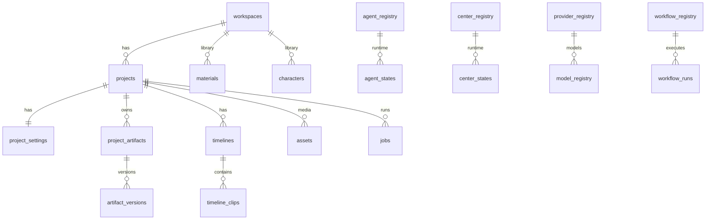

# AI Cut V1 数据库设计定稿（第一阶段交付物）

> 本阶段：**仅数据库结构 + Repository 契约 + 文档**。未接业务、未迁移 JSON。

---

## ① 数据库目录结构

```text
database/
├── README.md
├── DESIGN.md                    # 本文件
├── schema/
│   ├── 000_init.sql             # 一键执行入口
│   ├── 001_extensions.sql
│   ├── 010_identity.sql         # Identity
│   ├── 020_registry.sql         # Registry（14 类）
│   ├── 030_project.sql          # Project
│   ├── 040_library.sql          # Library
│   ├── 050_assets.sql           # Asset（统一）
│   ├── 060_timeline.sql         # Timeline
│   ├── 070_execution.sql        # Execution
│   ├── 080_qa.sql
│   ├── 090_export.sql
│   ├── 100_cost.sql
│   ├── 110_logs.sql
│   └── 999_indexes.sql
├── seeders/
│   └── 001_registry.sql
├── repositories/
│   ├── README.md
│   └── interfaces.ts            # Repository 契约（无实现）
├── mapping/
│   └── json-to-database.md
└── docs/
    ├── object-storage.md
    ├── redis.md
    └── migration-plan.md
```

**初始化命令（确认后手动执行）：**

```bash
createdb ai_cut_v1
psql "$DATABASE_URL" -f database/schema/000_init.sql
psql "$DATABASE_URL" -f database/seeders/001_registry.sql
```

---

## ② PostgreSQL Schema 目录

见 `database/schema/`，按 AI Video OS 分层：

| 文件 | 层 |
|------|-----|
| 010 | Identity |
| 020 | Registry |
| 030 | Project |
| 040 | Library |
| 050 | Asset |
| 060 | Timeline |
| 070 | Execution |
| 080–110 | QA / Export / Cost / Logs |

---

## ③ 所有数据表（共 78 张 + 6 视图）

### Identity（3）
`users`, `workspaces`, `workspace_members`, `workspace_permissions`

### Registry（18）
`agent_registry`, `center_registry`, `provider_registry`, `model_registry`, `workflow_registry`, `workflow_registry_nodes`, `workflow_registry_edges`, `pipeline_registry`, `module_registry`, `engine_registry`, `job_registry`, `template_registry`, `resource_registry`, `artifact_registry`, `integration_registry`, `capability_registry`, `permission_registry`, `provider_credentials`

### Project（16）
`projects`, `project_settings`, `project_resources`, `project_assets`, `project_artifacts`, `artifact_versions`, `workbench_sessions`, `center_configs`, `center_states`, `agent_configs`, `agent_states`, `agent_prompts`, `agent_prompt_versions`, `project_shots`, `project_director_state`, `canvas_nodes`, `canvas_edges`, `canvas_sections`

### Library（20）
`materials`, `material_analyses`, `material_scripts`, `material_schedules`, `script_evolution_runs`, `script_evolution_records`, `characters`, `scenes`, `props`, `prompts`, `templates`, `template_versions`, `music_library`, `effects_library`, `voice_library`, `subtitle_library`, `glossaries`, `glossary_entries`, `storyboard_shots`, `provider_prompts`, `shot_locks`, `shot_timeline_entries`

### Asset（2 + 6 VIEW）
`assets`, `shot_assets`  
VIEW: `image_assets`, `video_assets`, `audio_assets`, `thumbnail_assets`, `export_assets`, `subtitle_assets`

### Timeline（7）
`timelines`, `timeline_tracks`, `timeline_clips`, `timeline_transitions`, `timeline_markers`, `clip_effects`, `script_segments`, `timeline_media_pool`

### Execution（10）
`jobs`, `job_steps`, `workflow_runs`, `workflow_run_logs`, `clip_agent_runs`, `clip_agent_commands`, `clip_intents`, `director_plan_clips`, `director_plan_subtitles`, `opencut_projects`, `edit_plan_variants`

### QA（4）
`qa_reports`, `qa_scores`, `qa_issues`, `qa_logs`

### Export（2）
`export_records`, `publish_records`

### Cost（2）
`cost_ledger`, `usage_stats_daily`, `legacy_json_mappings`

### Logs（5）
`activity_logs`, `center_logs`, `agent_logs`, `project_history_snapshots`, `module_settings`

---

## ④ 外键关系（核心）

```text
workspaces 1─N projects 1─N project_shots
projects 1─1 project_settings
projects 1─N project_artifacts 1─N artifact_versions
projects 1─N timelines 1─N timeline_clips
projects 1─N jobs 1─N job_steps
projects 1─N workflow_runs
projects N─M characters/scenes/props (via project_resources)
projects N─M assets (via project_assets, shot_assets)
artifact_versions ──► director_plan_clips / edit_graph payload (JSONB)
jobs ──► agent_registry / center_registry (slug, 非 FK 到业务表)
assets ──► 唯一媒体 FK 目标（characters.ref_asset_id 等）
materials ──► projects.source_material_id
```

**Center 解耦**：Center 之间 **无 FK**；仅共享 `project_id` + `job_id` + `timeline_id`。

---

## ⑤ 索引设计

见 `999_indexes.sql`，要点：

| 表 | 索引 |
|----|------|
| projects | (workspace_id, status), updated_at DESC |
| assets | (workspace_id, kind), UNIQUE(bucket, key), sha256 |
| jobs | (project_id, status, created_at), (workspace_id, job_type) |
| timeline_clips | (timeline_id, track, sort_order) |
| artifact_versions | (artifact_id, version DESC) |
| activity/center/agent_logs | (project_id, created_at DESC) |
| registry * | slug UNIQUE（已 PK/UNIQUE） |

---

## ⑥ Repository 结构

- 契约：`database/repositories/interfaces.ts`
- 规范：`database/repositories/README.md`
- **强制**：`app/` 禁止直连 PostgreSQL；Center/Agent/API 仅通过 Repository
- 实现：`pg/`、`legacy/` — **第二阶段** 再建

---

## ⑦ JSON → 数据库映射

见 `database/mapping/json-to-database.md`

---

## ⑧ 对象存储目录

见 `database/docs/object-storage.md`

---

## ⑨ Redis 设计

见 `database/docs/redis.md`

---

## ⑩ 数据迁移计划

见 `database/docs/migration-plan.md` — **本阶段不执行**

---

## 架构原则（已写入 Schema 设计）

| 原则 | 实现 |
|------|------|
| Center 不互调 | 无 cross-center FK；chain: Agent→Center→Engine→Timeline→OpenCut |
| 统一 Asset | 单表 `assets` + VIEW |
| Registry 扩展 | 14 类 registry 表，新增仅 INSERT |
| Workbench 瘦化 | `workbench_sessions` 仅 UI + projectId + syncVersion |
| JSON 保留 | `legacy_json_mappings` + 文档双写策略 |

---

## ER 图（总览）



---

**状态：第一阶段 Schema + Repository 契约已就绪，等待确认后进入 P1（PostgreSQL 连接 + Repository 实现，仍不改 API）。**
